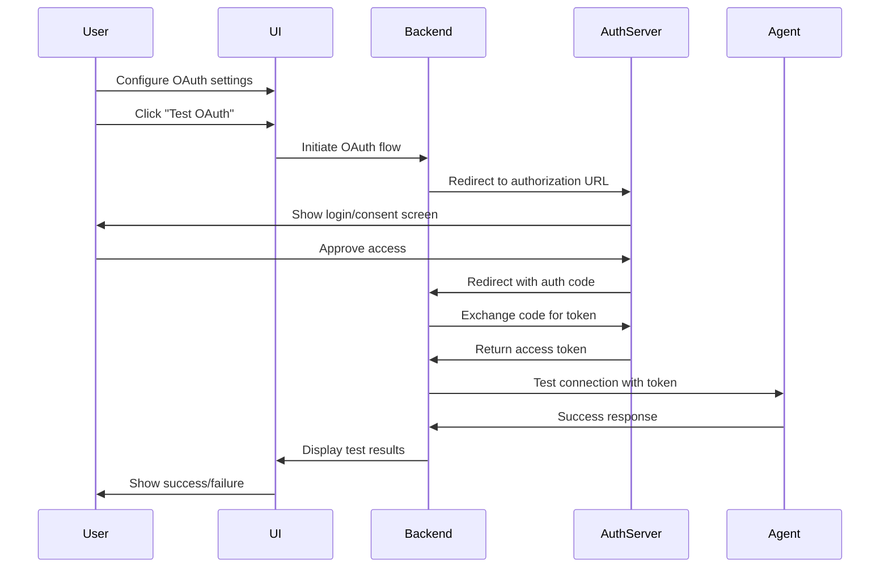
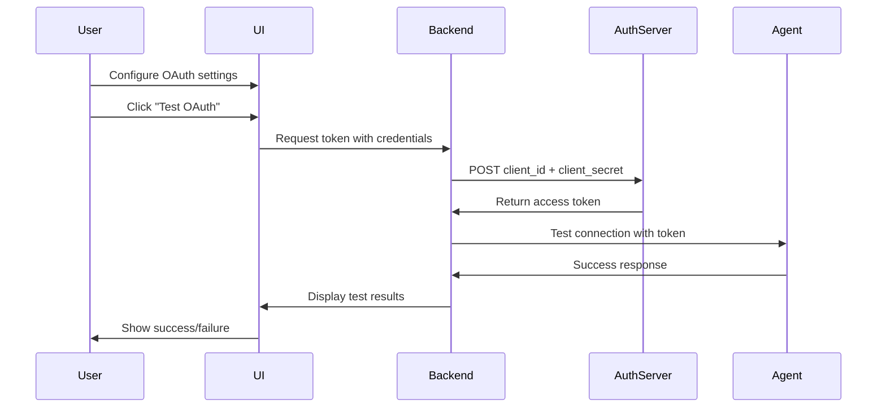

# A2A Agents Page Implementation Plan

## Executive Summary

This document outlines the implementation plan for the A2A (Agent-to-Agent) Agents page, which will enable users to register and manage A2A-compatible agents similar to how MCP Servers/Gateways are managed. The implementation will follow the established patterns from the MCP Servers page while accommodating the unique requirements of A2A agents.

## Table of Contents

1. [API Schema Analysis](#api-schema-analysis)
2. [Key Differences: Gateways vs A2A Agents](#key-differences-gateways-vs-a2a-agents)
3. [Authentication Patterns](#authentication-patterns)
4. [Architecture Overview](#architecture-overview)
5. [Implementation Plan](#implementation-plan)
6. [Component Structure](#component-structure)
7. [Data Flow](#data-flow)
8. [Testing Strategy](#testing-strategy)

---

## API Schema Analysis

### A2A Agent Schema (from generated client)

#### A2aAgentCreate (Required Fields for Creation)
```typescript
{
  name: string;                    // Required: Unique name for the agent
  endpoint_url: string;            // Required: URL endpoint for the agent
  slug?: string | null;            // Optional: Auto-generated if not provided
  description?: string | null;
  agent_type?: string;             // e.g., "openai", "anthropic", "custom"
  protocol_version?: string;       // A2A protocol version
  capabilities?: object;           // Agent capabilities and features
  config?: object;                 // Agent-specific configuration
  passthrough_headers?: string[];
  
  // Authentication fields
  auth_type?: string | null;       // "basic", "bearer", "headers", "oauth", "none"
  auth_username?: string | null;
  auth_password?: string | null;
  auth_token?: string | null;
  auth_header_key?: string | null;
  auth_header_value?: string | null;
  auth_headers?: Array<{[key: string]: string}> | null;
  oauth_config?: object | null;
  auth_value?: string | null;
  
  // Organization fields
  tags?: string[];
  team_id?: string | null;
  owner_email?: string | null;
  visibility?: string | null;      // "private", "team", "public"
}
```

#### A2aAgentRead (Response from API)
```typescript
{
  // All Create fields plus:
  id?: string | null;
  slug?: string | null;
  enabled: boolean;                // Active/inactive status
  reachable: boolean;              // Connection status
  createdAt: string;
  updatedAt: string;
  lastInteraction: string | null;
  metrics: A2aAgentMetrics;
  
  // Audit fields
  createdBy?: string | null;
  createdFromIp?: string | null;
  createdVia?: string | null;
  createdUserAgent?: string | null;
  modifiedBy?: string | null;
  modifiedFromIp?: string | null;
  modifiedVia?: string | null;
  modifiedUserAgent?: string | null;
  importBatchId?: string | null;
  federationSource?: string | null;
  version?: number | null;
  
  // Organization fields
  teamId?: string | null;
  team?: string | null;
  ownerEmail?: string | null;
  visibility?: string | null;
}
```

#### A2aAgentMetrics
```typescript
{
  totalExecutions: number;
  successfulExecutions: number;
  failedExecutions: number;
  failureRate: number;
  minResponseTime?: number | null;
  maxResponseTime?: number | null;
  avgResponseTime?: number | null;
  lastExecutionTime?: string | null;
}
```

### Available API Endpoints

From the generated client, we have these operations:
- `listA2aAgentsA2aGet()` - List all agents
- `createA2aAgentA2aPost()` - Create new agent
- `getA2aAgentA2aAgentIdGet()` - Get single agent
- `updateA2aAgentA2aAgentIdPut()` - Update agent
- `deleteA2aAgentA2aAgentIdDelete()` - Delete agent
- `toggleA2aAgentStatusA2aAgentIdTogglePost()` - Toggle enabled status
- `invokeA2aAgentA2aAgentNameInvokePost()` - Invoke agent

---

## Key Differences: Gateways vs A2A Agents

### Field Mapping Comparison

| Gateway Field | A2A Agent Field | Notes |
|--------------|-----------------|-------|
| `name` | `name` | ✓ Same |
| `url` | `endpoint_url` | Different field name |
| `description` | `description` | ✓ Same |
| `tags` | `tags` | ✓ Same |
| `active` | `enabled` | Different field name |
| `transport_type` | N/A | Gateway-specific (SSE/HTTP) |
| N/A | `agent_type` | Agent-specific (openai/anthropic/custom) |
| N/A | `protocol_version` | Agent-specific |
| N/A | `capabilities` | Agent-specific (JSON object) |
| N/A | `config` | Agent-specific (JSON object) |
| N/A | `reachable` | Agent-specific status |
| N/A | `metrics` | Agent-specific performance data |
| `passthrough_headers` | `passthrough_headers` | ✓ Same |
| `visibility` | `visibility` | ✓ Same |
| `team_id` | `team_id` | ✓ Same |

### UI Implications

1. **No Transport Type Dropdown**: Gateways have SSE/HTTP transport selection; A2A agents don't need this
2. **Agent Type Field**: New dropdown for agent type (openai, anthropic, custom)
3. **Protocol Version Field**: Text input for A2A protocol version
4. **Capabilities Editor**: JSON editor or structured form for capabilities
5. **Config Editor**: JSON editor or structured form for agent configuration
6. **Metrics Display**: Show performance metrics (executions, response times, failure rate)
7. **Reachability Indicator**: Visual indicator for agent reachability status

---

## Authentication Patterns

### Gateway Authentication
Gateways use a simpler authentication model:
- `auth_type`: Type of authentication
- `passthrough_headers`: Headers to pass through

### A2A Agent Authentication (More Complex)

A2A agents support **5 authentication types** with different field requirements:

#### 1. None (`auth_type: null` or `"none"`)
- No authentication fields required
- Simplest case

#### 2. Basic Authentication (`auth_type: "basic"`)
**Required Fields:**
- `auth_username`: Username for basic auth
- `auth_password`: Password for basic auth
- `auth_value`: Combined value (may be auto-populated)

**UI Requirements:**
- Username input field
- Password input field (masked)
- Optional: Show/hide password toggle

#### 3. Bearer Token (`auth_type: "bearer"`)
**Required Fields:**
- `auth_token`: Bearer token value
- `auth_value`: Token value (may be auto-populated)

**UI Requirements:**
- Token input field (masked or textarea for long tokens)
- Optional: Token validation indicator

#### 4. Custom Headers (`auth_type: "headers"`)
**Required Fields:**
- `auth_header_key`: Header name
- `auth_header_value`: Header value
- OR
- `auth_headers`: Array of header objects `[{key: value}]`

**UI Requirements:**
- Key-value pair inputs
- Add/remove header buttons
- Support for multiple headers

#### 5. OAuth 2.0 (`auth_type: "oauth"`)
**Required Fields:**
- `oauth_config`: Complex object containing:
  - `grant_type`: OAuth grant type
  - `client_id`: OAuth client ID
  - `client_secret`: OAuth client secret (encrypted)
  - `token_url`: Token endpoint URL
  - `auth_url`: Authorization endpoint URL
  - `scopes`: Array of OAuth scopes

**UI Requirements:**
- Multiple input fields for OAuth configuration
- Possibly a dedicated OAuth configuration modal
- Scope selector/input
- OAuth flow testing capability

### Authentication UI Component Strategy

```typescript
// Conditional rendering based on auth_type
const AuthenticationSection = ({ authType, values, onChange }) => {
  switch(authType) {
    case 'basic':
      return <BasicAuthFields values={values} onChange={onChange} />;
    case 'bearer':
      return <BearerTokenField values={values} onChange={onChange} />;
    case 'headers':
      return <CustomHeadersFields values={values} onChange={onChange} />;
    case 'oauth':
      return <OAuthConfigFields values={values} onChange={onChange} />;
    default:
      return <NoAuthMessage />;
  }
};
```

---

## Architecture Overview

### Layer Structure

```
┌─────────────────────────────────────────────────────────────┐
│                     AgentsPage Component                     │
│  - Main page container                                       │
│  - Fetches agents from API                                   │
│  - Manages view state (table/grid)                          │
│  - Handles panel open/close                                  │
└─────────────────────────────────────────────────────────────┘
                              │
                              ├─────────────────────────────────┐
                              │                                 │
                              ▼                                 ▼
┌──────────────────────────────────────┐    ┌──────────────────────────────┐
│      AgentTableView/GridView         │    │    AgentDetailsPanel         │
│  - Display agents in table/grid      │    │  - View/edit agent details   │
│  - Handle sorting/filtering          │    │  - Authentication config     │
│  - Action buttons (edit/delete)      │    │  - Capabilities editor       │
└──────────────────────────────────────┘    │  - Config editor             │
                                             └──────────────────────────────┘
                              │
                              ▼
┌─────────────────────────────────────────────────────────────┐
│                    Custom Hooks Layer                        │
│  - useAgentEditor: Manage form state                        │
│  - useAgentActions: CRUD operations                         │
│  - useAgentFilters: Filter/search logic                     │
└─────────────────────────────────────────────────────────────┘
                              │
                              ▼
┌─────────────────────────────────────────────────────────────┐
│                    API Layer (IPC)                           │
│  - contextforge-api-ipc.ts: Renderer process API            │
│  - contextforge-api-main.ts: Main process API               │
│  - agent-mapper.ts: Type conversions                        │
└─────────────────────────────────────────────────────────────┘
                              │
                              ▼
┌─────────────────────────────────────────────────────────────┐
│              Generated Client (OpenAPI)                      │
│  - listA2aAgentsA2aGet                                      │
│  - createA2aAgentA2aPost                                    │
│  - updateA2aAgentA2aAgentIdPut                              │
│  - deleteA2aAgentA2aAgentIdDelete                           │
│  - toggleA2aAgentStatusA2aAgentIdTogglePost                 │
└─────────────────────────────────────────────────────────────┘
```

---

## Implementation Plan

### Phase 1: Type Definitions & API Layer

#### 1.1 Create Agent Type Definition (`src/types/agent.ts`)

```typescript
export type A2AAgent = {
  id: string;
  name: string;
  slug?: string | null;
  endpointUrl: string;
  description: string;
  agentType: string;
  protocolVersion: string;
  capabilities: Record<string, unknown>;
  config: Record<string, unknown>;
  tags: string[];
  enabled: boolean;
  reachable: boolean;
  lastInteraction: string | null;
  team: string;
  teamId?: string | null;
  visibility: 'public' | 'team' | 'private';
  authType: string | null;
  authValue?: string | null;
  passthroughHeaders: string[];
  metrics: {
    totalExecutions: number;
    successfulExecutions: number;
    failedExecutions: number;
    failureRate: number;
    avgResponseTime?: number | null;
  };
  createdAt: string;
  updatedAt: string;
};
```

#### 1.2 Add API Functions to IPC Layer (`src/lib/api/contextforge-api-ipc.ts`)

```typescript
// A2A Agent operations
export async function listA2AAgents(): Promise<A2aAgentRead[]> {
  if (!isElectron) {
    throw new Error('This API wrapper requires Electron environment');
  }

  const response = await window.electronAPI.api.listA2AAgents();
  
  if (!response.success) {
    throw new Error('Failed to list A2A agents: ' + response.error);
  }
  
  return response.data || [];
}

export async function createA2AAgent(agentData: A2aAgentCreate) {
  if (!isElectron) {
    throw new Error('This API wrapper requires Electron environment');
  }

  const response = await window.electronAPI.api.createA2AAgent(agentData);
  
  if (!response.success) {
    throw new Error('Failed to create A2A agent: ' + response.error);
  }
  
  return response.data;
}

export async function updateA2AAgent(agentId: string, agentData: A2aAgentUpdate) {
  if (!isElectron) {
    throw new Error('This API wrapper requires Electron environment');
  }

  const response = await window.electronAPI.api.updateA2AAgent(agentId, agentData);
  
  if (!response.success) {
    throw new Error('Failed to update A2A agent: ' + response.error);
  }
  
  return response.data;
}

export async function deleteA2AAgent(agentId: string) {
  if (!isElectron) {
    throw new Error('This API wrapper requires Electron environment');
  }

  const response = await window.electronAPI.api.deleteA2AAgent(agentId);
  
  if (!response.success) {
    throw new Error('Failed to delete A2A agent: ' + response.error);
  }
  
  return response.data;
}

export async function toggleA2AAgentStatus(agentId: string, activate?: boolean) {
  if (!isElectron) {
    throw new Error('This API wrapper requires Electron environment');
  }

  const response = await window.electronAPI.api.toggleA2AAgentStatus(agentId, activate);
  
  if (!response.success) {
    throw new Error('Failed to toggle A2A agent status: ' + response.error);
  }
  
  return response.data;
}
```

#### 1.3 Create Agent Mapper (`src/lib/api/agent-mapper.ts`)

```typescript
import { A2aAgentRead, A2aAgentCreate, A2aAgentUpdate } from '../contextforge-client-ts';
import { A2AAgent } from '../../types/agent';

export function mapA2aAgentReadToA2AAgent(apiAgent: A2aAgentRead): A2AAgent {
  return {
    id: apiAgent.id || '',
    name: apiAgent.name,
    slug: apiAgent.slug,
    endpointUrl: apiAgent.endpointUrl,
    description: apiAgent.description || '',
    agentType: apiAgent.agentType,
    protocolVersion: apiAgent.protocolVersion,
    capabilities: apiAgent.capabilities,
    config: apiAgent.config,
    tags: apiAgent.tags || [],
    enabled: apiAgent.enabled,
    reachable: apiAgent.reachable,
    lastInteraction: apiAgent.lastInteraction,
    team: apiAgent.team || 'Unknown',
    teamId: apiAgent.teamId,
    visibility: (apiAgent.visibility as 'public' | 'team' | 'private') || 'public',
    authType: apiAgent.authType,
    authValue: apiAgent.authValue,
    passthroughHeaders: apiAgent.passthroughHeaders || [],
    metrics: {
      totalExecutions: apiAgent.metrics.totalExecutions,
      successfulExecutions: apiAgent.metrics.successfulExecutions,
      failedExecutions: apiAgent.metrics.failedExecutions,
      failureRate: apiAgent.metrics.failureRate,
      avgResponseTime: apiAgent.metrics.avgResponseTime,
    },
    createdAt: apiAgent.createdAt,
    updatedAt: apiAgent.updatedAt,
  };
}

export function mapA2AAgentToA2aAgentCreate(agent: Partial<A2AAgent>): A2aAgentCreate {
  return {
    name: agent.name!,
    slug: agent.slug,
    description: agent.description,
    endpoint_url: agent.endpointUrl!,
    agent_type: agent.agentType,
    protocol_version: agent.protocolVersion,
    capabilities: agent.capabilities,
    config: agent.config,
    passthrough_headers: agent.passthroughHeaders,
    auth_type: agent.authType,
    tags: agent.tags,
    team_id: agent.teamId,
    visibility: agent.visibility,
  };
}

export function mapA2AAgentToA2aAgentUpdate(agent: Partial<A2AAgent>): A2aAgentUpdate {
  return {
    name: agent.name,
    slug: agent.slug,
    description: agent.description,
    endpoint_url: agent.endpointUrl,
    agent_type: agent.agentType,
    protocol_version: agent.protocolVersion,
    capabilities: agent.capabilities,
    config: agent.config,
    passthrough_headers: agent.passthroughHeaders,
    auth_type: agent.authType,
    tags: agent.tags,
    team_id: agent.teamId,
    visibility: agent.visibility,
  };
}
```

### Phase 2: Custom Hooks

#### 2.1 Create useAgentEditor Hook (`src/hooks/useAgentEditor.ts`)

Similar to `useServerEditor` but with agent-specific fields:
- `editedAgentType`
- `editedProtocolVersion`
- `editedCapabilities`
- `editedConfig`
- `editedAuthType`
- `editedAuthUsername`
- `editedAuthPassword`
- `editedAuthToken`
- `editedAuthHeaderKey`
- `editedAuthHeaderValue`
- `editedOAuthConfig`

#### 2.2 Create useAgentActions Hook (`src/hooks/useAgentActions.ts`)

Similar to `useServerActions` but calling A2A agent API functions:
- `toggleAgentEnabled`
- `duplicateAgent`
- `deleteAgent`
- `saveAgent`

#### 2.3 Create useAgentFilters Hook (`src/hooks/useAgentFilters.ts`)

Similar to `useServerFilters` but with agent-specific filter categories:
- Agent Type
- Protocol Version
- Reachability Status
- Enabled/Disabled
- Tags
- Visibility
- Team

### Phase 3: UI Components

#### 3.1 AgentDetailsPanel Component

**Key Sections:**
1. **Basic Information**
   - Name (text input)
   - Endpoint URL (text input)
   - Description (textarea)
   - Agent Type (dropdown: openai, anthropic, custom)
   - Protocol Version (text input)

2. **Authentication Configuration**
   - Auth Type (dropdown: none, basic, bearer, headers, oauth)
   - Conditional auth fields based on type (see Authentication Patterns section)

3. **Advanced Configuration**
   - Capabilities (JSON editor or structured form)
   - Config (JSON editor or structured form)
   - Passthrough Headers (tag input)

4. **Organization**
   - Tags (tag input)
   - Visibility (dropdown: public, team, private)
   - Team (if applicable)

5. **Metrics Display** (view mode only)
   - Total Executions
   - Success Rate
   - Average Response Time
   - Last Interaction

#### 3.2 AgentTableView Component

**Columns:**
- Status indicator (enabled/reachable)
- Name
- Agent Type
- Endpoint URL
- Protocol Version
- Tags
- Team
- Last Interaction
- Actions (edit, duplicate, delete)

#### 3.3 AgentGridView Component

**Card Layout:**
- Agent icon/type indicator
- Name
- Status badges (enabled, reachable)
- Endpoint URL (truncated)
- Tags
- Metrics summary
- Action buttons

#### 3.4 AgentFilterDropdown Component

**Filter Categories:**
- Agent Type
- Protocol Version
- Status (enabled/disabled)
- Reachability
- Tags
- Visibility
- Team

### Phase 4: Main Page Component

#### 4.1 AgentsPage Component (`src/components/AgentsPage.tsx`)

Structure similar to `MCPServersPage.tsx`:
- Fetch agents on mount
- Handle authentication (login if needed)
- Manage view mode (table/grid)
- Handle side panel state
- Integrate all hooks and child components

### Phase 5: Navigation Integration

#### 5.1 Update SideNav Component

Add "A2A Agents" navigation item:
```typescript
{
  name: 'A2A Agents',
  icon: <AgentIcon />,
  path: '/agents',
  badge: agentCount
}
```

---

## Component Structure

```
src/components/
├── AgentsPage.tsx                 # Main page component
├── AgentDetailsPanel.tsx          # Side panel for view/edit
├── AgentTableView.tsx             # Table view of agents
├── AgentGridView.tsx              # Grid view of agents
├── AgentFilterDropdown.tsx        # Filter dropdown
└── AgentAuthenticationFields.tsx  # Authentication configuration UI

src/hooks/
├── useAgentEditor.ts              # Form state management
├── useAgentActions.ts             # CRUD operations
└── useAgentFilters.ts             # Filter logic

src/lib/api/
├── agent-mapper.ts                # Type conversions
├── contextforge-api-ipc.ts        # Updated with agent functions
└── contextforge-api-main.ts       # Updated with agent functions

src/types/
└── agent.ts                       # Agent type definitions
```

---

## Data Flow

### Creating a New Agent

```
User clicks "Add Agent"
    ↓
AgentsPage opens AgentDetailsPanel in 'add' mode
    ↓
useAgentEditor initializes empty form state
    ↓
User fills in agent details (name, endpoint, auth, etc.)
    ↓
User clicks "Save"
    ↓
useAgentActions.saveAgent() called
    ↓
mapA2AAgentToA2aAgentCreate() converts to API format
    ↓
api.createA2AAgent() sends to backend
    ↓
Backend returns A2aAgentRead
    ↓
mapA2aAgentReadToA2AAgent() converts to UI format
    ↓
Agent added to local state
    ↓
Panel closes, table/grid updates
    ↓
Success toast displayed
```

### Toggling Agent Status

```
User clicks toggle switch
    ↓
useAgentActions.toggleAgentEnabled() called
    ↓
Optimistic UI update (immediate feedback)
    ↓
api.toggleA2AAgentStatus() sends to backend
    ↓
Backend returns updated agent
    ↓
Refresh agent list to ensure sync
    ↓
Update selected agent if it's the toggled one
    ↓
Show toast with undo option (if disabling)
```

---

## Testing Strategy

### Unit Tests
- Test type mappers (agent-mapper.ts)
- Test custom hooks in isolation
- Test authentication field validation

### Integration Tests
- Test full CRUD flow
- Test authentication configuration for each type
- Test filter combinations
- Test view mode switching

### E2E Tests
- Create agent with different auth types
- Edit agent and verify changes persist
- Delete agent and verify removal
- Toggle agent status
- Test undo functionality

### Manual Testing Checklist
- [ ] Create agent with no authentication
- [ ] Create agent with basic authentication
- [ ] Create agent with bearer token
- [ ] Create agent with custom headers
- [ ] Create agent with OAuth configuration
- [ ] Edit agent and change authentication type
- [ ] Toggle agent enabled/disabled status
- [ ] Delete agent and undo
- [ ] Filter agents by various criteria
- [ ] Switch between table and grid views
- [ ] Verify metrics display correctly
- [ ] Test with different team contexts

---

## Authentication Implementation Details

### Auth Type Dropdown Options

```typescript
const AUTH_TYPES = [
  { value: 'none', label: 'No Authentication' },
  { value: 'basic', label: 'Basic Authentication' },
  { value: 'bearer', label: 'Bearer Token' },
  { value: 'headers', label: 'Custom Headers' },
  { value: 'oauth', label: 'OAuth 2.0' },
];
```

### Authentication Field Components

#### BasicAuthFields Component
```typescript
<div className="space-y-4">
  <div>
    <label>Username</label>
    <input
      type="text"
      value={authUsername}
      onChange={(e) => setAuthUsername(e.target.value)}
    />
  </div>
  <div>
    <label>Password</label>
    <input
      type="password"
      value={authPassword}
      onChange={(e) => setAuthPassword(e.target.value)}
    />
  </div>
</div>
```

#### BearerTokenField Component
```typescript
<div>
  <label>Bearer Token</label>
  <textarea
    value={authToken}
    onChange={(e) => setAuthToken(e.target.value)}
    placeholder="Enter bearer token..."
  />
</div>
```

#### CustomHeadersFields Component
```typescript
<div className="space-y-2">
  <label>Custom Headers</label>
  {headers.map((header, index) => (
    <div key={index} className="flex gap-2">
      <input
        placeholder="Header Key"
        value={header.key}
        onChange={(e) => updateHeader(index, 'key', e.target.value)}
      />
      <input
        placeholder="Header Value"
        value={header.value}
        onChange={(e) => updateHeader(index, 'value', e.target.value)}
      />
      <button onClick={() => removeHeader(index)}>Remove</button>
    </div>
  ))}
  <button onClick={addHeader}>Add Header</button>
</div>
```

#### OAuthConfigFields Component
```typescript
<div className="space-y-4">
  <div>
    <label>Grant Type</label>
    <select value={grantType} onChange={(e) => setGrantType(e.target.value)}>
      <option value="authorization_code">Authorization Code</option>
      <option value="client_credentials">Client Credentials</option>
      <option value="password">Password</option>
    </select>
  </div>
  <div>
    <label>Client ID</label>
    <input value={clientId} onChange={(e) => setClientId(e.target.value)} />
  </div>
  <div>
    <label>Client Secret</label>
    <input
      type="password"
      value={clientSecret}
      onChange={(e) => setClientSecret(e.target.value)}
    />
  </div>
  <div>
    <label>Token URL</label>
    <input value={tokenUrl} onChange={(e) => setTokenUrl(e.target.value)} />
  </div>
  <div>
    <label>Authorization URL</label>
    <input value={authUrl} onChange={(e) => setAuthUrl(e.target.value)} />
  </div>
  <div>
    <label>Scopes (comma-separated)</label>
    <input
      value={scopes}
      onChange={(e) => setScopes(e.target.value)}
      placeholder="read, write, admin"
    />
  </div>
</div>
```

---

## Migration Notes

### Differences from Gateway Implementation

1. **Field Names**: `url` → `endpoint_url`, `active` → `enabled`
2. **No Transport Type**: Agents don't have SSE/HTTP distinction
3. **Additional Fields**: `agent_type`, `protocol_version`, `capabilities`, `config`
4. **Complex Authentication**: 5 auth types vs simpler gateway auth
5. **Metrics**: Agents have execution metrics, gateways don't
6. **Reachability**: Agents have `reachable` status indicator

### Code Reuse Opportunities

- Filter logic structure (useServerFilters → useAgentFilters)
- Action patterns (useServerActions → useAgentActions)
- Table/Grid view layouts
- Side panel structure
- Toast notifications and undo functionality

### New Patterns Required

- JSON editor for capabilities/config
- Complex authentication UI with conditional rendering
- Metrics display components
- Reachability status indicators

---

## Success Criteria

- [ ] Users can view all registered A2A agents
- [ ] Users can create new agents with all authentication types
- [ ] Users can edit existing agents
- [ ] Users can delete agents with undo capability
- [ ] Users can toggle agent enabled/disabled status
- [ ] Users can filter agents by multiple criteria
- [ ] Users can switch between table and grid views
- [ ] Authentication configuration works for all 5 types
- [ ] Metrics display correctly
- [ ] Reachability status updates properly
- [ ] All CRUD operations sync with backend
- [ ] Error handling provides clear feedback
- [ ] UI matches design system and theme

---

## OAuth Testing Flow Implementation

### Overview

OAuth 2.0 authentication requires a sophisticated testing flow to ensure proper configuration before saving an agent. This section outlines the implementation of an interactive OAuth testing system.

### OAuth Flow Types

#### 1. Authorization Code Flow (Most Common)


#### 2. Client Credentials Flow


### UI Components for OAuth Testing

#### OAuthTestingModal Component

```typescript
interface OAuthTestingModalProps {
  isOpen: boolean;
  onClose: () => void;
  oauthConfig: OAuthConfig;
  agentEndpoint: string;
  onTestComplete: (result: OAuthTestResult) => void;
}

interface OAuthTestResult {
  success: boolean;
  step: 'authorization' | 'token_exchange' | 'agent_connection';
  message: string;
  token?: string;
  expiresIn?: number;
  scopes?: string[];
  error?: string;
  errorDetails?: string;
}

export function OAuthTestingModal({
  isOpen,
  onClose,
  oauthConfig,
  agentEndpoint,
  onTestComplete
}: OAuthTestingModalProps) {
  const [testState, setTestState] = useState<'idle' | 'testing' | 'success' | 'error'>('idle');
  const [currentStep, setCurrentStep] = useState<string>('');
  const [testResult, setTestResult] = useState<OAuthTestResult | null>(null);
  const [authWindow, setAuthWindow] = useState<Window | null>(null);

  const startOAuthTest = async () => {
    setTestState('testing');
    setCurrentStep('Initiating OAuth flow...');

    try {
      // Step 1: Get authorization URL
      const authUrl = await api.getOAuthAuthorizationUrl(oauthConfig);
      
      // Step 2: Open popup window for authorization
      const popup = window.open(
        authUrl,
        'oauth-authorization',
        'width=600,height=700,left=200,top=100'
      );
      setAuthWindow(popup);
      setCurrentStep('Waiting for authorization...');

      // Step 3: Listen for callback
      const result = await waitForOAuthCallback(popup);
      
      if (result.success) {
        setCurrentStep('Testing agent connection...');
        
        // Step 4: Test agent connection with token
        const connectionTest = await api.testAgentConnection(
          agentEndpoint,
          result.token
        );
        
        if (connectionTest.success) {
          setTestState('success');
          setTestResult({
            success: true,
            step: 'agent_connection',
            message: 'OAuth configuration successful!',
            token: result.token,
            expiresIn: result.expiresIn,
            scopes: result.scopes,
          });
          onTestComplete(testResult);
        } else {
          throw new Error('Agent connection failed: ' + connectionTest.error);
        }
      } else {
        throw new Error('Authorization failed: ' + result.error);
      }
    } catch (error) {
      setTestState('error');
      setTestResult({
        success: false,
        step: currentStep,
        message: 'OAuth test failed',
        error: (error as Error).message,
      });
    }
  };

  return (
    <Dialog open={isOpen} onOpenChange={onClose}>
      <DialogContent className="max-w-2xl">
        <DialogHeader>
          <DialogTitle>Test OAuth Configuration</DialogTitle>
          <DialogDescription>
            Verify your OAuth settings by completing the authorization flow
          </DialogDescription>
        </DialogHeader>

        <div className="space-y-4">
          {/* OAuth Configuration Summary */}
          <div className="bg-gray-50 dark:bg-gray-800 p-4 rounded-lg">
            <h4 className="font-semibold mb-2">Configuration</h4>
            <dl className="space-y-1 text-sm">
              <div className="flex justify-between">
                <dt className="text-gray-600 dark:text-gray-400">Grant Type:</dt>
                <dd className="font-mono">{oauthConfig.grant_type}</dd>
              </div>
              <div className="flex justify-between">
                <dt className="text-gray-600 dark:text-gray-400">Client ID:</dt>
                <dd className="font-mono">{oauthConfig.client_id}</dd>
              </div>
              <div className="flex justify-between">
                <dt className="text-gray-600 dark:text-gray-400">Token URL:</dt>
                <dd className="font-mono text-xs">{oauthConfig.token_url}</dd>
              </div>
              <div className="flex justify-between">
                <dt className="text-gray-600 dark:text-gray-400">Scopes:</dt>
                <dd className="font-mono text-xs">{oauthConfig.scopes?.join(', ')}</dd>
              </div>
            </dl>
          </div>

          {/* Test Progress */}
          {testState === 'testing' && (
            <div className="space-y-3">
              <div className="flex items-center gap-3">
                <Loader2 className="h-5 w-5 animate-spin" />
                <span>{currentStep}</span>
              </div>
              <Progress value={getProgressValue(currentStep)} />
            </div>
          )}

          {/* Success State */}
          {testState === 'success' && testResult && (
            <Alert className="border-green-500 bg-green-50 dark:bg-green-900/20">
              <CheckCircle2 className="h-4 w-4 text-green-600" />
              <AlertTitle>OAuth Test Successful!</AlertTitle>
              <AlertDescription>
                <div className="mt-2 space-y-2">
                  <p>{testResult.message}</p>
                  {testResult.token && (
                    <div className="bg-white dark:bg-gray-800 p-2 rounded text-xs font-mono">
                      Token: {testResult.token.substring(0, 20)}...
                    </div>
                  )}
                  {testResult.expiresIn && (
                    <p className="text-sm">Expires in: {testResult.expiresIn} seconds</p>
                  )}
                  {testResult.scopes && (
                    <p className="text-sm">Granted scopes: {testResult.scopes.join(', ')}</p>
                  )}
                </div>
              </AlertDescription>
            </Alert>
          )}

          {/* Error State */}
          {testState === 'error' && testResult && (
            <Alert variant="destructive">
              <AlertCircle className="h-4 w-4" />
              <AlertTitle>OAuth Test Failed</AlertTitle>
              <AlertDescription>
                <div className="mt-2 space-y-2">
                  <p><strong>Step:</strong> {testResult.step}</p>
                  <p><strong>Error:</strong> {testResult.error}</p>
                  {testResult.errorDetails && (
                    <details className="mt-2">
                      <summary className="cursor-pointer text-sm">View Details</summary>
                      <pre className="mt-2 text-xs bg-black/10 p-2 rounded overflow-auto">
                        {testResult.errorDetails}
                      </pre>
                    </details>
                  )}
                </div>
              </AlertDescription>
            </Alert>
          )}

          {/* Troubleshooting Tips */}
          {testState === 'error' && (
            <div className="bg-blue-50 dark:bg-blue-900/20 p-4 rounded-lg">
              <h4 className="font-semibold mb-2 flex items-center gap-2">
                <Info className="h-4 w-4" />
                Troubleshooting Tips
              </h4>
              <ul className="text-sm space-y-1 list-disc list-inside">
                <li>Verify your Client ID and Client Secret are correct</li>
                <li>Ensure the redirect URI is registered in your OAuth provider</li>
                <li>Check that the requested scopes are available</li>
                <li>Confirm the token URL and authorization URL are correct</li>
                <li>Make sure your OAuth provider allows the grant type you selected</li>
              </ul>
            </div>
          )}
        </div>

        <DialogFooter>
          <Button variant="outline" onClick={onClose}>
            Close
          </Button>
          {testState === 'idle' && (
            <Button onClick={startOAuthTest}>
              Start OAuth Test
            </Button>
          )}
          {testState === 'error' && (
            <Button onClick={startOAuthTest}>
              Retry Test
            </Button>
          )}
        </DialogFooter>
      </DialogContent>
    </Dialog>
  );
}
```

### Backend API Endpoints for OAuth Testing

#### New API Functions Needed

```typescript
// In contextforge-api-ipc.ts

export async function getOAuthAuthorizationUrl(oauthConfig: OAuthConfig): Promise<string> {
  if (!isElectron) {
    throw new Error('This API wrapper requires Electron environment');
  }

  const response = await window.electronAPI.api.getOAuthAuthorizationUrl(oauthConfig);
  
  if (!response.success) {
    throw new Error('Failed to get OAuth authorization URL: ' + response.error);
  }
  
  return response.data;
}

export async function exchangeOAuthCode(
  code: string,
  oauthConfig: OAuthConfig
): Promise<OAuthTokenResponse> {
  if (!isElectron) {
    throw new Error('This API wrapper requires Electron environment');
  }

  const response = await window.electronAPI.api.exchangeOAuthCode(code, oauthConfig);
  
  if (!response.success) {
    throw new Error('Failed to exchange OAuth code: ' + response.error);
  }
  
  return response.data;
}

export async function testAgentConnection(
  agentEndpoint: string,
  accessToken: string
): Promise<AgentConnectionTestResult> {
  if (!isElectron) {
    throw new Error('This API wrapper requires Electron environment');
  }

  const response = await window.electronAPI.api.testAgentConnection(
    agentEndpoint,
    accessToken
  );
  
  if (!response.success) {
    throw new Error('Failed to test agent connection: ' + response.error);
  }
  
  return response.data;
}

export async function refreshOAuthToken(
  refreshToken: string,
  oauthConfig: OAuthConfig
): Promise<OAuthTokenResponse> {
  if (!isElectron) {
    throw new Error('This API wrapper requires Electron environment');
  }

  const response = await window.electronAPI.api.refreshOAuthToken(
    refreshToken,
    oauthConfig
  );
  
  if (!response.success) {
    throw new Error('Failed to refresh OAuth token: ' + response.error);
  }
  
  return response.data;
}
```

### OAuth Callback Handler

#### Electron Main Process Handler

```typescript
// In main.ts or oauth-handler.ts

import { BrowserWindow } from 'electron';

export class OAuthHandler {
  private authWindow: BrowserWindow | null = null;
  private callbackUrl: string = 'http://localhost:3000/oauth/callback';

  async initiateOAuthFlow(oauthConfig: OAuthConfig): Promise<string> {
    // Build authorization URL
    const params = new URLSearchParams({
      client_id: oauthConfig.client_id,
      redirect_uri: this.callbackUrl,
      response_type: 'code',
      scope: oauthConfig.scopes?.join(' ') || '',
      state: this.generateState(),
    });

    const authUrl = `${oauthConfig.auth_url}?${params.toString()}`;

    // Create auth window
    this.authWindow = new BrowserWindow({
      width: 600,
      height: 700,
      webPreferences: {
        nodeIntegration: false,
        contextIsolation: true,
      },
    });

    // Load authorization URL
    await this.authWindow.loadURL(authUrl);

    // Wait for callback
    return new Promise((resolve, reject) => {
      const timeout = setTimeout(() => {
        this.closeAuthWindow();
        reject(new Error('OAuth authorization timeout'));
      }, 300000); // 5 minute timeout

      // Listen for navigation to callback URL
      this.authWindow?.webContents.on('will-redirect', (event, url) => {
        if (url.startsWith(this.callbackUrl)) {
          clearTimeout(timeout);
          const urlObj = new URL(url);
          const code = urlObj.searchParams.get('code');
          const error = urlObj.searchParams.get('error');

          this.closeAuthWindow();

          if (error) {
            reject(new Error(`OAuth error: ${error}`));
          } else if (code) {
            resolve(code);
          } else {
            reject(new Error('No authorization code received'));
          }
        }
      });

      // Handle window close
      this.authWindow?.on('closed', () => {
        clearTimeout(timeout);
        reject(new Error('Authorization window closed'));
      });
    });
  }

  async exchangeCodeForToken(
    code: string,
    oauthConfig: OAuthConfig
  ): Promise<OAuthTokenResponse> {
    const response = await fetch(oauthConfig.token_url, {
      method: 'POST',
      headers: {
        'Content-Type': 'application/x-www-form-urlencoded',
      },
      body: new URLSearchParams({
        grant_type: 'authorization_code',
        code: code,
        redirect_uri: this.callbackUrl,
        client_id: oauthConfig.client_id,
        client_secret: oauthConfig.client_secret,
      }),
    });

    if (!response.ok) {
      const error = await response.text();
      throw new Error(`Token exchange failed: ${error}`);
    }

    return await response.json();
  }

  private closeAuthWindow() {
    if (this.authWindow && !this.authWindow.isDestroyed()) {
      this.authWindow.close();
      this.authWindow = null;
    }
  }

  private generateState(): string {
    return Math.random().toString(36).substring(2, 15);
  }
}
```

### Integration with AgentDetailsPanel

```typescript
// In AgentDetailsPanel.tsx

const [showOAuthTest, setShowOAuthTest] = useState(false);
const [oauthTestResult, setOAuthTestResult] = useState<OAuthTestResult | null>(null);

// Add "Test OAuth" button when auth_type is 'oauth'
{editedAuthType === 'oauth' && (
  <div className="flex gap-2">
    <Button
      variant="outline"
      onClick={() => setShowOAuthTest(true)}
      disabled={!isOAuthConfigValid()}
    >
      <TestTube className="h-4 w-4 mr-2" />
      Test OAuth Configuration
    </Button>
    {oauthTestResult?.success && (
      <Badge variant="success">
        <CheckCircle2 className="h-3 w-3 mr-1" />
        OAuth Verified
      </Badge>
    )}
  </div>
)}

{/* OAuth Testing Modal */}
<OAuthTestingModal
  isOpen={showOAuthTest}
  onClose={() => setShowOAuthTest(false)}
  oauthConfig={editedOAuthConfig}
  agentEndpoint={editedEndpointUrl}
  onTestComplete={(result) => {
    setOAuthTestResult(result);
    if (result.success) {
      toast.success('OAuth configuration verified successfully!');
    }
  }}
/>
```

### OAuth Configuration Validation

```typescript
function isOAuthConfigValid(): boolean {
  if (!editedOAuthConfig) return false;
  
  const required = [
    'grant_type',
    'client_id',
    'client_secret',
    'token_url',
  ];

  if (editedOAuthConfig.grant_type === 'authorization_code') {
    required.push('auth_url');
  }

  return required.every(field =>
    editedOAuthConfig[field] && editedOAuthConfig[field].trim() !== ''
  );
}
```

### OAuth Token Storage and Refresh

```typescript
// Store OAuth tokens securely
interface StoredOAuthToken {
  agentId: string;
  accessToken: string;
  refreshToken?: string;
  expiresAt: number;
  scopes: string[];
}

// Token refresh logic
async function ensureValidToken(agentId: string): Promise<string> {
  const stored = await getStoredToken(agentId);
  
  if (!stored) {
    throw new Error('No OAuth token found for agent');
  }

  // Check if token is expired or about to expire (within 5 minutes)
  const now = Date.now();
  const expiresIn = stored.expiresAt - now;
  
  if (expiresIn < 300000) { // Less than 5 minutes
    if (stored.refreshToken) {
      // Refresh the token
      const agent = await getAgent(agentId);
      const newToken = await refreshOAuthToken(
        stored.refreshToken,
        agent.oauthConfig
      );
      
      // Store new token
      await storeToken(agentId, {
        accessToken: newToken.access_token,
        refreshToken: newToken.refresh_token || stored.refreshToken,
        expiresAt: now + (newToken.expires_in * 1000),
        scopes: newToken.scope?.split(' ') || stored.scopes,
      });
      
      return newToken.access_token;
    } else {
      throw new Error('Token expired and no refresh token available');
    }
  }
  
  return stored.accessToken;
}
```

### Testing Checklist for OAuth Implementation

- [ ] Authorization Code flow works with popup window
- [ ] Client Credentials flow works without user interaction
- [ ] Token exchange completes successfully
- [ ] Agent connection test uses obtained token
- [ ] Error messages are clear and actionable
- [ ] Token refresh works automatically
- [ ] Tokens are stored securely (encrypted)
- [ ] OAuth window closes properly on success/failure
- [ ] Timeout handling works correctly
- [ ] State parameter prevents CSRF attacks
- [ ] Redirect URI validation works
- [ ] Multiple OAuth providers tested (Google, GitHub, Auth0, etc.)
- [ ] Scope validation and display works
- [ ] Token expiration is handled gracefully

---

## Future Enhancements

1. **Agent Testing**: Add "Test Connection" button to verify agent reachability
2. **Capability Builder**: Visual builder for agent capabilities
3. **Config Templates**: Pre-built config templates for common agent types
4. **Metrics Dashboard**: Detailed metrics and analytics page
5. **Agent Invocation UI**: Interface to invoke agents directly from UI
6. **Batch Operations**: Bulk enable/disable/delete agents
7. **Import/Export**: Import agents from JSON/YAML files
8. **Agent Marketplace**: Browse and install pre-configured agents
9. **OAuth Token Management**: View and revoke stored OAuth tokens
10. **OAuth Provider Presets**: Pre-configured settings for popular OAuth providers

---

## Conclusion

This implementation plan provides a comprehensive roadmap for building the A2A Agents page. The architecture follows established patterns from the MCP Servers page while accommodating the unique requirements of A2A agents, particularly the complex authentication system. By following this plan phase by phase, we'll create a robust, user-friendly interface for managing A2A agents.