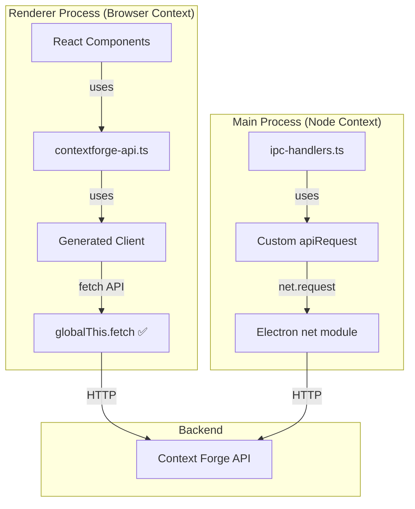

# Generated Client Analysis & Migration Plan

## Executive Summary

The project has **two separate API implementations**:
1. **Generated Client** ([`contextforge-api.ts`](../src/lib/api/contextforge-api.ts)) - Used in renderer process ✅ WORKS
2. **Custom `apiRequest`** ([`ipc-handlers.ts`](../src/ipc-handlers.ts)) - Used in main process ⚠️ NEEDS MIGRATION

## Root Cause Analysis

### Why the Custom Implementation Exists

The custom `apiRequest` function in [`ipc-handlers.ts`](../src/ipc-handlers.ts:9-53) was created because:

1. **Electron Main Process Limitation**: The main process doesn't have `fetch` API available by default
2. **Generated Client Dependency**: The generated client uses `globalThis.fetch` ([`client.gen.ts:48`](../src/lib/contextforge-client-ts/client/client.gen.ts:48))
3. **Electron's net Module**: The custom implementation uses Electron's `net.request()` API instead

### Current Architecture



## Key Findings

### 1. Generated Client IS Working (Renderer Process)

The generated client in [`contextforge-api.ts`](../src/lib/api/contextforge-api.ts:1-140) successfully:
- ✅ Handles authentication with bearer tokens
- ✅ Manages server CRUD operations
- ✅ Provides type-safe API calls
- ✅ Uses proper error handling

### 2. Main Process Uses Custom Implementation

The [`ipc-handlers.ts`](../src/ipc-handlers.ts:9-53) custom `apiRequest`:
- ⚠️ Duplicates functionality that exists in generated client
- ⚠️ Requires manual maintenance for API changes
- ⚠️ Lacks type safety from generated types
- ✅ Works with Electron's `net` module

### 3. Critical Differences

| Aspect | Generated Client | Custom apiRequest |
|--------|-----------------|-------------------|
| **Environment** | Renderer (Browser) | Main (Node) |
| **HTTP Client** | `fetch` API | `net.request()` |
| **Type Safety** | ✅ Full TypeScript types | ⚠️ Manual typing |
| **Maintenance** | ✅ Auto-generated | ⚠️ Manual updates |
| **Auth Handling** | ✅ Built-in via client config | ⚠️ Manual headers |
| **Error Handling** | ✅ Structured responses | ⚠️ Manual parsing |

## Solution: Fetch Adapter for Main Process

### Strategy

Create a **fetch-compatible adapter** that wraps Electron's `net` module, allowing the generated client to work in the main process.

### Implementation Plan

#### Step 1: Create Electron Fetch Adapter

Create [`src/lib/api/electron-fetch-adapter.ts`](../src/lib/api/electron-fetch-adapter.ts):

```typescript
import { net } from 'electron';

/**
 * Fetch-compatible adapter for Electron's net module
 * Allows generated client to work in main process
 */
export function createElectronFetchAdapter(): typeof fetch {
  return async (input: RequestInfo | URL, init?: RequestInit): Promise<Response> => {
    // Convert Request/URL to string
    const url = input instanceof Request ? input.url : input.toString();
    
    // Extract method and headers
    const method = init?.method || 'GET';
    const headers = new Headers(init?.headers);
    
    return new Promise((resolve, reject) => {
      const request = net.request({
        method,
        url,
      });
      
      // Set headers
      headers.forEach((value, key) => {
        request.setHeader(key, value);
      });
      
      let responseData = '';
      let statusCode = 0;
      let responseHeaders: Record<string, string> = {};
      
      request.on('response', (response) => {
        statusCode = response.statusCode;
        responseHeaders = response.headers as Record<string, string>;
        
        response.on('data', (chunk) => {
          responseData += chunk.toString();
        });
        
        response.on('end', () => {
          // Create fetch-compatible Response
          const fetchResponse = new Response(responseData, {
            status: statusCode,
            statusText: getStatusText(statusCode),
            headers: new Headers(responseHeaders),
          });
          
          resolve(fetchResponse);
        });
      });
      
      request.on('error', (error) => {
        reject(error);
      });
      
      // Send body if present
      if (init?.body) {
        request.write(init.body as string);
      }
      
      request.end();
    });
  };
}

function getStatusText(status: number): string {
  const statusTexts: Record<number, string> = {
    200: 'OK',
    201: 'Created',
    204: 'No Content',
    400: 'Bad Request',
    401: 'Unauthorized',
    403: 'Forbidden',
    404: 'Not Found',
    500: 'Internal Server Error',
  };
  return statusTexts[status] || 'Unknown';
}
```

#### Step 2: Create Main Process API Wrapper

Create [`src/lib/api/contextforge-api-main.ts`](../src/lib/api/contextforge-api-main.ts):

```typescript
import {
  listServersServersGet,
  createServerServersPost,
  updateServerServersServerIdPut,
  deleteServerServersServerIdDelete,
  toggleServerStatusServersServerIdTogglePost,
  loginAuthEmailLoginPost,
  getCurrentUserProfileAuthEmailMeGet,
  type ServerRead,
  type ServerCreate,
  type ServerUpdate,
  type EmailUserResponse
} from '../contextforge-client-ts';
import { client } from '../contextforge-client-ts/client.gen';
import { createElectronFetchAdapter } from './electron-fetch-adapter';

// Configure client for main process
const API_BASE_URL = 'http://localhost:4444';
let authToken: string | null = null;

// Set up Electron fetch adapter
const electronFetch = createElectronFetchAdapter();

export function configureMainClient(token?: string) {
  authToken = token || null;
  
  client.setConfig({
    baseUrl: API_BASE_URL,
    fetch: electronFetch as any, // Use Electron adapter
    headers: token ? {
      'Authorization': `Bearer ${token}`
    } : {}
  });
}

// Initialize on module load
configureMainClient();

// Authentication
export async function login(email: string, password: string) {
  const response = await loginAuthEmailLoginPost({
    body: { email, password }
  });
  
  if (response.error) {
    throw new Error('Login failed: ' + JSON.stringify(response.error));
  }
  
  const token = (response.data as any)?.access_token;
  if (token) {
    configureMainClient(token);
  }
  
  return response.data;
}

// Server operations
export async function listServers(includeInactive = true) {
  const response = await listServersServersGet({
    query: { include_inactive: includeInactive }
  });
  
  if (response.error) {
    throw new Error('Failed to list servers: ' + JSON.stringify(response.error));
  }
  
  return response.data || [];
}

export async function createServer(serverData: ServerCreate) {
  const response = await createServerServersPost({
    body: { server: serverData }
  });
  
  if (response.error) {
    throw new Error('Failed to create server: ' + JSON.stringify(response.error));
  }
  
  return response.data;
}

export async function updateServer(serverId: string, serverData: ServerUpdate) {
  const response = await updateServerServersServerIdPut({
    path: { server_id: serverId },
    body: serverData
  });
  
  if (response.error) {
    throw new Error('Failed to update server: ' + JSON.stringify(response.error));
  }
  
  return response.data;
}

export async function deleteServer(serverId: string) {
  const response = await deleteServerServersServerIdDelete({
    path: { server_id: serverId }
  });
  
  if (response.error) {
    throw new Error('Failed to delete server: ' + JSON.stringify(response.error));
  }
  
  return response.data;
}

export async function toggleServerStatus(serverId: string, activate?: boolean) {
  const response = await toggleServerStatusServersServerIdTogglePost({
    path: { server_id: serverId },
    query: activate !== undefined ? { activate } : undefined
  });
  
  if (response.error) {
    throw new Error('Failed to toggle server status: ' + JSON.stringify(response.error));
  }
  
  return response.data;
}

export async function getCurrentUser() {
  const response = await getCurrentUserProfileAuthEmailMeGet();
  
  if (response.error) {
    throw new Error('Failed to get current user: ' + JSON.stringify(response.error));
  }
  
  return response.data;
}

// Type exports
export type { ServerRead, ServerCreate, ServerUpdate, EmailUserResponse };
```

#### Step 3: Update IPC Handlers

Modify [`ipc-handlers.ts`](../src/ipc-handlers.ts) to use the new main process API:

```typescript
import { ipcMain, BrowserWindow } from 'electron';
import { TrayManager } from './tray-manager';
import * as mainApi from './lib/api/contextforge-api-main';

export function setupIpcHandlers(trayManager: TrayManager, mainWindow: BrowserWindow): void {
  // ... tray handlers remain the same ...

  // API handlers - now using generated client
  ipcMain.handle('api:login', async (_event, email: string, password: string) => {
    try {
      console.log('IPC Handler: Login attempt for', email);
      const response = await mainApi.login(email, password);
      console.log('IPC Handler: Login successful');
      return { success: true, data: response };
    } catch (error) {
      console.error('IPC Handler: Login failed', error);
      return { success: false, error: (error as Error).message };
    }
  });

  ipcMain.handle('api:get-current-user', async () => {
    try {
      const response = await mainApi.getCurrentUser();
      return { success: true, data: response };
    } catch (error) {
      return { success: false, error: (error as Error).message };
    }
  });

  ipcMain.handle('api:list-servers', async () => {
    try {
      const response = await mainApi.listServers(true);
      return { success: true, data: response };
    } catch (error) {
      return { success: false, error: (error as Error).message };
    }
  });

  // ... continue for all other handlers ...
}
```

## Benefits of Migration

### 1. Type Safety
- ✅ Full TypeScript types from OpenAPI spec
- ✅ Compile-time error checking
- ✅ Better IDE autocomplete

### 2. Maintainability
- ✅ Single source of truth (OpenAPI spec)
- ✅ Auto-generated client updates
- ✅ No manual API changes needed

### 3. Consistency
- ✅ Same API interface in renderer and main
- ✅ Unified error handling
- ✅ Consistent authentication flow

### 4. Reduced Code
- ✅ Remove ~300 lines of custom code
- ✅ Eliminate duplicate logic
- ✅ Simpler codebase

## Testing Strategy

### Phase 1: Adapter Testing
1. Create unit tests for `electron-fetch-adapter.ts`
2. Test GET, POST, PUT, DELETE methods
3. Verify header handling
4. Test error scenarios

### Phase 2: Integration Testing
1. Test login flow in main process
2. Verify server CRUD operations
3. Test authentication token handling
4. Verify all IPC handlers work correctly

### Phase 3: End-to-End Testing
1. Test full application flow
2. Verify renderer ↔ main communication
3. Test error handling across processes
4. Performance testing

## Migration Checklist

- [ ] Create `electron-fetch-adapter.ts`
- [ ] Create `contextforge-api-main.ts`
- [ ] Update `ipc-handlers.ts` to use new API
- [ ] Add unit tests for adapter
- [ ] Add integration tests
- [ ] Test all API endpoints
- [ ] Update documentation
- [ ] Remove old `apiRequest` function
- [ ] Deploy and monitor

## Risks & Mitigations

| Risk | Impact | Mitigation |
|------|--------|------------|
| Fetch adapter bugs | High | Comprehensive testing, gradual rollout |
| Performance regression | Medium | Benchmark before/after, optimize if needed |
| Breaking changes | High | Keep old code until fully tested |
| Auth token handling | High | Test thoroughly, add logging |

## Conclusion

The generated client **DOES work** - it's successfully used in the renderer process. The main process just needs a fetch adapter to bridge Electron's `net` module with the fetch API that the generated client expects.

This migration will:
- ✅ Eliminate code duplication
- ✅ Improve type safety
- ✅ Simplify maintenance
- ✅ Unify the codebase

**Recommendation**: Proceed with creating the fetch adapter and migrating the main process to use the generated client.