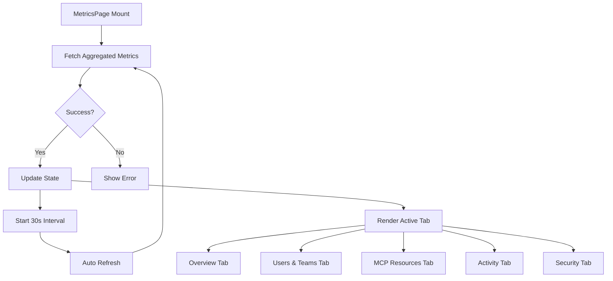

# Metrics Dashboard Architecture Plan

## Overview
This document outlines the architecture and implementation plan for a comprehensive metrics and observability dashboard that adheres to the app's existing design system and patterns.

## Design Principles
- **Consistency**: Follow existing component patterns from MCPServersPage, AgentsPage, etc.
- **Modularity**: Create reusable metric components
- **Performance**: Use 30-second auto-refresh with efficient data fetching
- **Accessibility**: Maintain theme support (light/dark mode)
- **Scalability**: Design for future metric additions

## Data Architecture

### API Endpoints
Primary data source: `/admin/metrics` (aggregated metrics endpoint)

```typescript
// Expected response structure
interface AggregatedMetrics {
  users: {
    total: number;
    active: number;
    inactive: number;
    admins: number;
  };
  teams: {
    total: number;
    personal: number;
    organizational: number;
    totalMembers: number;
  };
  mcpResources: {
    virtualServers: number;
    gatewayPeers: number;
    tools: number;
    resources: number;
    prompts: number;
    a2aAgents: number;
  };
  activity: {
    totalExecutions: number;
    successRate: number;
    avgResponseTime: number;
    errorRate: number;
  };
  security: {
    authEvents: number;
    auditLogs: number;
    pendingApprovals: number;
    ssoProviders: number;
    teamInvitations: number;
    joinRequests: number;
  };
  resourceMetrics: {
    tools: ToolMetrics[];
    resources: ResourceMetrics[];
    prompts: PromptMetrics[];
    servers: ServerMetrics[];
  };
}
```

### Type Definitions
Leverage existing types from `src/lib/contextforge-client-ts/types.gen.ts`:
- `A2aAgentMetrics`
- `PromptMetrics`
- `ResourceMetrics`
- `ServerMetrics`
- `ToolMetrics`

## Component Architecture

```
MetricsPage (Main Container)
├── PageHeader
├── Tabs (Navigation)
│   ├── Overview Tab
│   ├── Users & Teams Tab
│   ├── MCP Resources Tab
│   ├── Activity Tab
│   └── Security Tab
└── Export Button

Reusable Components:
├── StatCard (Colored summary cards)
├── MetricCard (Detailed metric panels)
├── MetricRow (Individual metric line items)
├── PerformanceIndicator (Icon + value + label)
└── TopPerformersTable (Sortable data table)
```

### Component Specifications

#### 1. MetricsPage Component
**File**: `src/components/MetricsPage.tsx`

**Responsibilities**:
- Fetch aggregated metrics from API
- Manage 30-second auto-refresh interval
- Handle loading and error states
- Coordinate tab navigation
- Trigger CSV export

**State Management**:
```typescript
const [metricsData, setMetricsData] = useState<AggregatedMetrics | null>(null);
const [isLoading, setIsLoading] = useState(true);
const [error, setError] = useState<string | null>(null);
const [activeTab, setActiveTab] = useState<string>('overview');
const [lastRefresh, setLastRefresh] = useState<Date>(new Date());
```

**Hooks**:
- `useTheme()` - Theme context
- `useTeam()` - Team filtering
- `useEffect()` - Auto-refresh logic

#### 2. StatCard Component
**File**: `src/components/metrics/StatCard.tsx`

**Purpose**: Display high-level summary statistics with colored backgrounds

**Props**:
```typescript
interface StatCardProps {
  icon: React.ReactNode;
  label: string;
  value: number | string;
  subtitle?: string;
  color: 'blue' | 'purple' | 'green' | 'orange';
  theme: string;
}
```

**Styling**: 
- Rounded corners (`rounded-xl`)
- Colored backgrounds with opacity
- Large prominent numbers
- Icon in top-left
- Follows card component patterns

#### 3. MetricCard Component
**File**: `src/components/metrics/MetricCard.tsx`

**Purpose**: Display grouped metrics with header and multiple rows

**Props**:
```typescript
interface MetricCardProps {
  icon: React.ReactNode;
  title: string;
  metrics: Array<{
    icon?: React.ReactNode;
    label: string;
    value: number | string;
    color?: string;
  }>;
  theme: string;
}
```

**Layout**:
- Card with border
- Header with icon and title
- List of metric rows
- Consistent spacing

#### 4. MetricRow Component
**File**: `src/components/metrics/MetricRow.tsx`

**Purpose**: Single metric line item within a card

**Props**:
```typescript
interface MetricRowProps {
  icon?: React.ReactNode;
  label: string;
  value: number | string;
  color?: string;
  theme: string;
}
```

#### 5. PerformanceIndicator Component
**File**: `src/components/metrics/PerformanceIndicator.tsx`

**Purpose**: Display key performance metrics with icons

**Props**:
```typescript
interface PerformanceIndicatorProps {
  icon: React.ReactNode;
  value: string | number;
  label: string;
  color: string;
  theme: string;
}
```

**Features**:
- Large icon with colored border
- Prominent value display
- Descriptive label below

#### 6. TopPerformersTable Component
**File**: `src/components/metrics/TopPerformersTable.tsx`

**Purpose**: Sortable table showing top performing resources

**Props**:
```typescript
interface TopPerformersTableProps {
  data: Array<{
    rank: number;
    name: string;
    executions: number;
    avgResponseTime: number;
    successRate: number;
    lastUsed: string;
  }>;
  type: 'tools' | 'resources' | 'prompts' | 'servers';
  theme: string;
}
```

**Features**:
- Tab navigation for resource types
- Sortable columns
- Rank badges
- Formatted timestamps
- Success rate with color coding

## Tab Content Specifications

### Overview Tab
**Components**:
1. **Summary Cards Row** (4 cards)
   - Total Users (blue background)
   - Total Teams (purple background)
   - MCP Resources (green background)
   - Total Metrics (orange background)

2. **Performance Indicators Row** (4 indicators)
   - Total Executions (target icon)
   - Success Rate (checkmark icon)
   - Avg Response Time (lightning icon)
   - Error Rate (X icon)

3. **Top Performers Section**
   - Tabbed interface (Tools, Resources, Prompts, Servers)
   - Sortable table with columns:
     - Rank
     - Name
     - Executions
     - Avg Response Time
     - Success Rate
     - Last Used

### Users & Teams Tab
**Layout**: Two-column grid

**Left Column - Users Card**:
- Total Users
- ✅ Active
- ❌ Inactive
- 👑 Admins

**Right Column - Teams Card**:
- Total Teams
- 👤 Personal
- 🏢 Organizational
- 🤝 Team Members

### MCP Resources Tab
**Layout**: 2x3 grid of metric cards

**Cards**:
1. Virtual Servers (computer icon)
2. Gateway Peers (globe icon)
3. Tools (wrench icon)
4. Resources (books icon)
5. Prompts (chat icon)
6. A2A Agents (robot icon)

### Activity Tab
**Layout**: Grid of metric cards (3 columns)

**Cards for each resource type** (Tools, Resources, Prompts, Servers):
- Total Executions
- Successful Executions
- Failed Executions
- Failure Rate
- Average Response Time
- Last Execution Time

### Security Tab
**Layout**: Two-column grid

**Left Column - Audit & Events Card**:
- 🔒 Auth Events
- 📋 Audit Logs
- ⏳ Pending Approvals
- 🔑 SSO Providers

**Right Column - Workflow State Card**:
- 📧 Team Invitations
- 🙋 Join Requests

## Styling Guidelines

### Color Palette
Following existing theme variables:

**Light Mode**:
- Background: `oklch(1 0 0)`
- Card: `oklch(1 0 0)`
- Border: `oklch(0.922 0 0)`
- Text: `oklch(0.145 0 0)`
- Muted: `oklch(0.556 0 0)`

**Dark Mode**:
- Background: `oklch(0.145 0 0)`
- Card: `oklch(0.205 0 0)`
- Border: `oklch(1 0 0 / 10%)`
- Text: `oklch(0.985 0 0)`
- Muted: `oklch(0.708 0 0)`

**Accent Colors**:
- Blue: `bg-blue-100 dark:bg-blue-950`
- Purple: `bg-purple-100 dark:bg-purple-950`
- Green: `bg-green-100 dark:bg-green-950`
- Orange: `bg-orange-100 dark:bg-orange-950`

### Typography
- Page Title: `text-[18px] font-semibold leading-[28px]`
- Card Title: `text-[16px] font-semibold`
- Metric Label: `text-[14px] font-normal`
- Metric Value: `text-[24px] font-bold`
- Small Text: `text-[12px]`

### Spacing
- Page Padding: `p-[32px]`
- Card Padding: `p-6`
- Gap between cards: `gap-6`
- Card border radius: `rounded-xl`

### Icons
Use Lucide React icons:
- Users: `Users`
- Teams: `Users` (multiple)
- Server: `Server`
- Globe: `Globe`
- Wrench: `Wrench`
- Book: `BookOpen`
- Message: `MessageSquare`
- Robot: `Bot`
- Target: `Target`
- Check: `CheckCircle`
- Lightning: `Zap`
- X: `XCircle`
- Lock: `Lock`
- File: `FileText`
- Clock: `Clock`
- Key: `Key`
- Mail: `Mail`
- UserPlus: `UserPlus`

## Data Flow



## API Integration

### Add to contextforge-api-ipc.ts
```typescript
export async function getAggregatedMetrics() {
  if (!isElectron) {
    throw new Error('This API wrapper requires Electron environment');
  }

  const response = await window.electronAPI.api.getAggregatedMetrics();
  
  if (!response.success) {
    throw new Error('Failed to get metrics: ' + response.error);
  }
  
  return response.data;
}

export async function exportMetricsToCSV(metrics: AggregatedMetrics) {
  // Convert metrics to CSV format
  // Trigger download
}
```

### Add to contextforge-api-main.ts
```typescript
ipcMain.handle('api:getAggregatedMetrics', async () => {
  try {
    const response = await getAggregatedMetricsAdminMetricsGet({
      client: apiClient
    });
    return { success: true, data: response.data };
  } catch (error) {
    return { success: false, error: (error as Error).message };
  }
});
```

## Export Functionality

### CSV Export Structure
```csv
Category,Metric,Value
Users,Total,1
Users,Active,1
Users,Inactive,0
Teams,Total,2
Teams,Personal,1
...
```

### Implementation
```typescript
function exportToCSV(metrics: AggregatedMetrics) {
  const rows = [
    ['Category', 'Metric', 'Value'],
    // Users
    ['Users', 'Total', metrics.users.total],
    ['Users', 'Active', metrics.users.active],
    // ... more rows
  ];
  
  const csv = rows.map(row => row.join(',')).join('\n');
  const blob = new Blob([csv], { type: 'text/csv' });
  const url = URL.createObjectURL(blob);
  const a = document.createElement('a');
  a.href = url;
  a.download = `metrics-${new Date().toISOString()}.csv`;
  a.click();
}
```

## Error Handling

### Loading States
- Show skeleton loaders for cards during initial load
- Show spinner for refresh operations
- Maintain previous data during refresh

### Error States
- Display error message with retry button
- Log errors to console
- Show toast notification for failures
- Graceful degradation (show partial data if available)

### Authentication
- Auto-login if credentials available
- Redirect to login if unauthorized
- Handle token expiration

## Performance Considerations

### Optimization Strategies
1. **Memoization**: Use `useMemo` for computed values
2. **Debouncing**: Debounce tab switches
3. **Lazy Loading**: Load tab content on demand
4. **Data Caching**: Cache metrics data between refreshes
5. **Efficient Re-renders**: Use `React.memo` for static components

### Auto-Refresh Logic
```typescript
useEffect(() => {
  const interval = setInterval(() => {
    fetchMetrics();
  }, 30000); // 30 seconds

  return () => clearInterval(interval);
}, []);
```

## Accessibility

### ARIA Labels
- Add `aria-label` to all interactive elements
- Use `role="region"` for tab panels
- Provide `aria-live` for auto-updating metrics

### Keyboard Navigation
- Tab through all interactive elements
- Arrow keys for tab navigation
- Enter/Space to activate buttons

### Screen Reader Support
- Announce metric updates
- Provide context for numbers
- Label all charts and graphs

## Testing Strategy

### Unit Tests
- Test metric calculations
- Test CSV export formatting
- Test error handling

### Integration Tests
- Test API integration
- Test auto-refresh behavior
- Test tab navigation

### Visual Tests
- Test theme switching
- Test responsive layout
- Test loading states

## File Structure

```
src/
├── components/
│   ├── MetricsPage.tsx (main component)
│   └── metrics/
│       ├── StatCard.tsx
│       ├── MetricCard.tsx
│       ├── MetricRow.tsx
│       ├── PerformanceIndicator.tsx
│       ├── TopPerformersTable.tsx
│       ├── OverviewTab.tsx
│       ├── UsersTeamsTab.tsx
│       ├── MCPResourcesTab.tsx
│       ├── ActivityTab.tsx
│       └── SecurityTab.tsx
├── hooks/
│   └── useMetrics.ts (custom hook for metrics fetching)
├── lib/
│   └── api/
│       ├── contextforge-api-ipc.ts (add metrics methods)
│       └── contextforge-api-main.ts (add IPC handlers)
└── types/
    └── metrics.ts (TypeScript interfaces)
```

## Implementation Phases

### Phase 1: Foundation (Priority: High)
- [ ] Create base MetricsPage component
- [ ] Add API integration methods
- [ ] Implement auto-refresh logic
- [ ] Create reusable metric components

### Phase 2: Core Tabs (Priority: High)
- [ ] Implement Overview tab
- [ ] Implement Users & Teams tab
- [ ] Implement MCP Resources tab

### Phase 3: Advanced Features (Priority: Medium)
- [ ] Implement Activity tab
- [ ] Implement Security tab
- [ ] Add Top Performers table

### Phase 4: Polish (Priority: Medium)
- [ ] Add CSV export functionality
- [ ] Implement loading skeletons
- [ ] Add error boundaries
- [ ] Optimize performance

### Phase 5: Testing & Documentation (Priority: Low)
- [ ] Write unit tests
- [ ] Add integration tests
- [ ] Update user documentation
- [ ] Add inline code comments

## Success Criteria

✅ Dashboard displays all metrics from screenshots
✅ Auto-refreshes every 30 seconds
✅ Supports light and dark themes
✅ Exports metrics to CSV
✅ Ranks resources by execution count
✅ Handles errors gracefully
✅ Maintains consistent styling with app
✅ Responsive layout works on different screen sizes
✅ Accessible to keyboard and screen reader users

## Future Enhancements

- Real-time WebSocket updates
- Historical metrics charts
- Custom date range filtering
- Metric alerts and notifications
- Downloadable PDF reports
- Metric comparison views
- Custom dashboard layouts