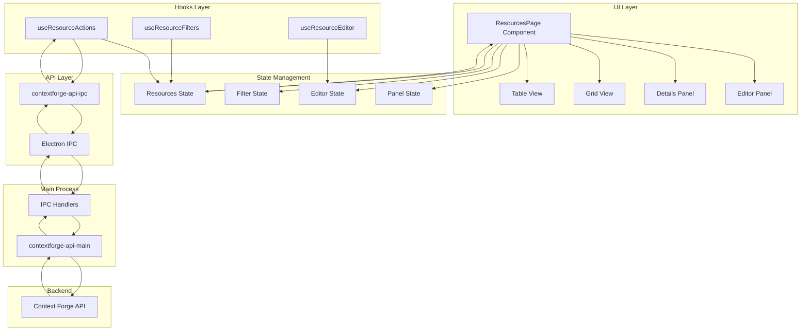
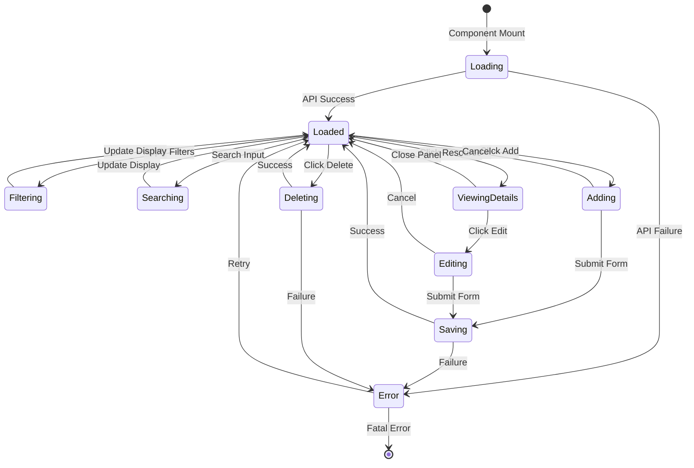
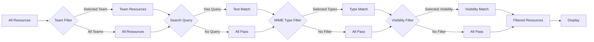
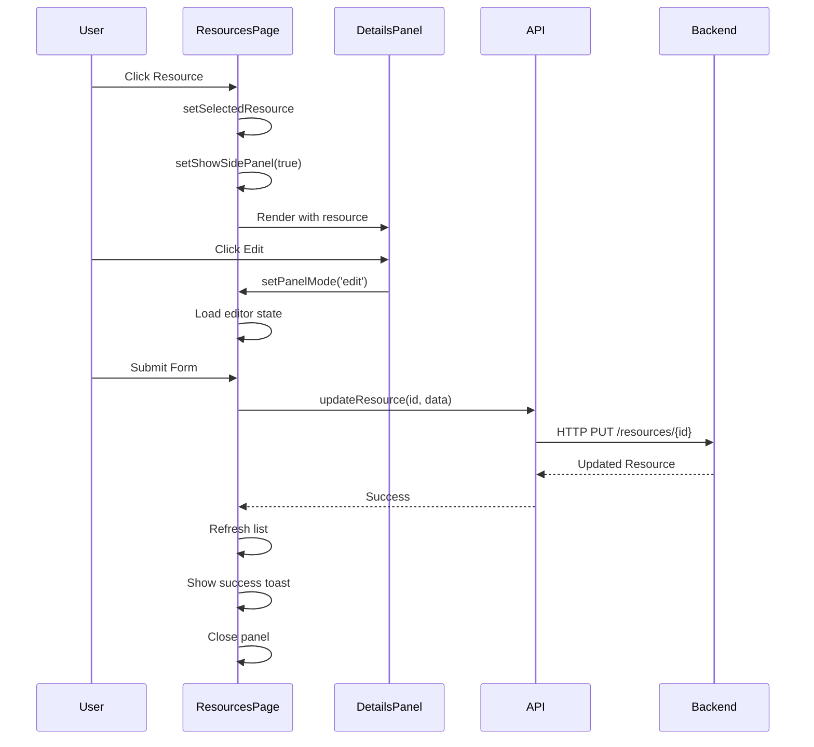
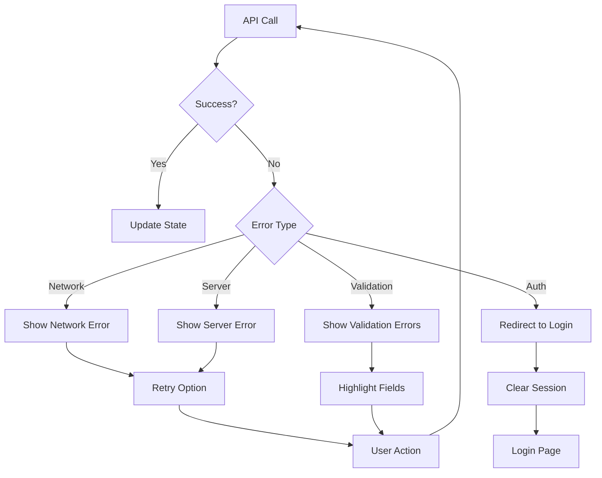

# Resources Page Architecture

## Component Hierarchy

```
ResourcesPage
├── PageHeader
│   ├── Title & Description
│   ├── Search Input
│   └── Action Buttons
│       ├── Add Resource
│       └── Bulk Import
│
├── DataTableToolbar
│   ├── View Mode Toggle (Table/Grid)
│   ├── Filter Dropdown
│   │   ├── MIME Type Filters
│   │   ├── Visibility Filters
│   │   └── Tag Filters
│   └── Active Filters Display
│
├── Main Content Area
│   ├── Table View
│   │   ├── Column Headers (sortable)
│   │   ├── Resource Rows
│   │   │   ├── Name + URI
│   │   │   ├── MIME Type Badge
│   │   │   ├── Size Display
│   │   │   ├── Description
│   │   │   ├── Tags
│   │   │   ├── Status Badge
│   │   │   └── Actions Dropdown
│   │   └── Empty State
│   │
│   └── Grid View
│       ├── Resource Cards
│       │   ├── Card Header (Name + Status)
│       │   ├── MIME Type Badge
│       │   ├── Size Display
│       │   ├── Description Preview
│       │   ├── Tags
│       │   └── Action Buttons
│       └── Empty State
│
└── Side Panels
    ├── Details Panel (View Mode)
    │   ├── Header Section
    │   │   ├── Name & URI
    │   │   ├── Status Badge
    │   │   └── Close Button
    │   ├── Content Section
    │   │   ├── MIME Type Info
    │   │   ├── Size Info
    │   │   ├── Description
    │   │   └── Content Preview
    │   │       ├── Text Viewer (syntax highlighted)
    │   │       ├── JSON Viewer (formatted)
    │   │       ├── Image Preview
    │   │       └── Download Button (binary)
    │   ├── Metadata Section
    │   │   ├── Tags
    │   │   ├── Visibility
    │   │   ├── Team
    │   │   └── Owner
    │   ├── Metrics Section
    │   │   ├── Total Invocations
    │   │   ├── Success Rate
    │   │   ├── Avg Response Time
    │   │   └── Last Accessed
    │   ├── Audit Section
    │   │   ├── Created By/At
    │   │   ├── Modified By/At
    │   │   └── Version
    │   └── Actions Section
    │       ├── Edit Button
    │       ├── Toggle Status
    │       ├── Delete Button
    │       └── Test/Preview Button
    │
    └── Editor Panel (Add/Edit Mode)
        ├── Header Section
        │   ├── Title (Add/Edit Resource)
        │   └── Close Button
        ├── Form Section
        │   ├── URI Input (required)
        │   ├── Name Input (required)
        │   ├── Title Input (optional)
        │   ├── Description Textarea
        │   ├── MIME Type Selector
        │   ├── Content Input
        │   │   ├── Text Area
        │   │   ├── File Upload
        │   │   └── URL Import
        │   ├── Tags Multi-Select
        │   ├── Visibility Radio Group
        │   ├── Team Selector (if team visibility)
        │   └── Active Toggle
        └── Actions Section
            ├── Save Button
            ├── Cancel Button
            └── Validation Messages
```

## Data Flow Architecture



## State Management Flow



## API Integration Pattern

```typescript
// Hook Pattern
export function useResourceActions() {
  const [isLoading, setIsLoading] = useState(false);
  const [error, setError] = useState<string | null>(null);
  
  const listResources = async () => {
    try {
      setIsLoading(true);
      setError(null);
      const resources = await api.listResources();
      return resources;
    } catch (err) {
      setError((err as Error).message);
      throw err;
    } finally {
      setIsLoading(false);
    }
  };
  
  const createResource = async (data: ResourceCreate) => {
    try {
      setIsLoading(true);
      setError(null);
      const resource = await api.createResource(data);
      toast.success('Resource created successfully');
      return resource;
    } catch (err) {
      setError((err as Error).message);
      toast.error('Failed to create resource');
      throw err;
    } finally {
      setIsLoading(false);
    }
  };
  
  // ... other operations
  
  return {
    listResources,
    createResource,
    updateResource,
    deleteResource,
    toggleStatus,
    isLoading,
    error
  };
}
```

## Filter Logic Flow



## Component Communication



## Error Handling Strategy



## Performance Optimization

### Memoization Strategy

```typescript
// Memoize filtered resources
const filteredResources = useMemo(() => {
  return applyFilters(teamFilteredResources, {
    searchQuery,
    selectedMimeTypes,
    selectedVisibility,
    selectedTags
  });
}, [teamFilteredResources, searchQuery, selectedMimeTypes, selectedVisibility, selectedTags]);

// Memoize sorted resources
const sortedResources = useMemo(() => {
  return sortResources(filteredResources, sortConfig);
}, [filteredResources, sortConfig]);

// Memoize MIME type options
const mimeTypeOptions = useMemo(() => {
  return extractUniqueMimeTypes(resourcesData);
}, [resourcesData]);
```

### Virtualization for Large Lists

```typescript
// For table view with 1000+ resources
import { useVirtualizer } from '@tanstack/react-virtual';

const rowVirtualizer = useVirtualizer({
  count: filteredResources.length,
  getScrollElement: () => parentRef.current,
  estimateSize: () => 60, // Row height
  overscan: 5
});
```

## Security Considerations

### Content Sanitization

```typescript
// Sanitize HTML content before display
import DOMPurify from 'dompurify';

const sanitizedContent = DOMPurify.sanitize(resource.content, {
  ALLOWED_TAGS: ['b', 'i', 'em', 'strong', 'a', 'p', 'br'],
  ALLOWED_ATTR: ['href', 'title']
});
```

### URI Validation

```typescript
// Validate URI format
const validateUri = (uri: string): boolean => {
  const uriPattern = /^[a-z][a-z0-9+.-]*:\/\/.+$/i;
  return uriPattern.test(uri);
};

// Check for malicious URIs
const isSafeUri = (uri: string): boolean => {
  const dangerousSchemes = ['javascript:', 'data:', 'vbscript:'];
  return !dangerousSchemes.some(scheme => 
    uri.toLowerCase().startsWith(scheme)
  );
};
```

### File Upload Security

```typescript
// Validate file size
const MAX_FILE_SIZE = 50 * 1024 * 1024; // 50MB

const validateFileSize = (file: File): boolean => {
  return file.size <= MAX_FILE_SIZE;
};

// Validate MIME type
const ALLOWED_MIME_TYPES = [
  'text/plain',
  'application/json',
  'image/png',
  'image/jpeg',
  'application/pdf'
];

const validateMimeType = (file: File): boolean => {
  return ALLOWED_MIME_TYPES.includes(file.type);
};
```

## Accessibility Features

### Keyboard Navigation

```typescript
// Table row keyboard handlers
const handleKeyDown = (e: React.KeyboardEvent, resource: Resource) => {
  switch (e.key) {
    case 'Enter':
    case ' ':
      e.preventDefault();
      handleViewResource(resource);
      break;
    case 'Delete':
      e.preventDefault();
      handleDeleteResource(resource.id);
      break;
    case 'e':
      if (e.ctrlKey || e.metaKey) {
        e.preventDefault();
        handleEditResource(resource);
      }
      break;
  }
};
```

### ARIA Labels

```typescript
// Accessible table
<table role="table" aria-label="Resources list">
  <thead>
    <tr role="row">
      <th role="columnheader" aria-sort={sortDirection}>
        Name
      </th>
    </tr>
  </thead>
  <tbody>
    {resources.map(resource => (
      <tr 
        role="row" 
        aria-label={`Resource: ${resource.name}`}
        tabIndex={0}
      >
        {/* ... */}
      </tr>
    ))}
  </tbody>
</table>
```

## Testing Strategy

### Unit Tests

```typescript
describe('ResourcesPage', () => {
  it('should render resource list', () => {
    render(<ResourcesPage />);
    expect(screen.getByText('Resources')).toBeInTheDocument();
  });
  
  it('should filter resources by MIME type', () => {
    const { result } = renderHook(() => useResourceFilters(mockResources));
    act(() => {
      result.current.setSelectedMimeTypes(['text/plain']);
    });
    expect(result.current.filteredResources).toHaveLength(5);
  });
  
  it('should create resource successfully', async () => {
    const { result } = renderHook(() => useResourceActions());
    await act(async () => {
      await result.current.createResource(mockResourceData);
    });
    expect(result.current.error).toBeNull();
  });
});
```

### Integration Tests

```typescript
describe('Resource CRUD Operations', () => {
  it('should complete full CRUD cycle', async () => {
    // Create
    const created = await api.createResource(testData);
    expect(created.id).toBeDefined();
    
    // Read
    const read = await api.readResource(created.id);
    expect(read.name).toBe(testData.name);
    
    // Update
    const updated = await api.updateResource(created.id, { name: 'Updated' });
    expect(updated.name).toBe('Updated');
    
    // Delete
    await api.deleteResource(created.id);
    await expect(api.readResource(created.id)).rejects.toThrow();
  });
});
```

## Deployment Checklist

- [ ] All components implemented
- [ ] API integration complete
- [ ] Error handling robust
- [ ] Loading states implemented
- [ ] Empty states designed
- [ ] Accessibility tested
- [ ] Performance optimized
- [ ] Security validated
- [ ] Tests passing
- [ ] Documentation updated
- [ ] Code reviewed
- [ ] User acceptance testing
- [ ] Production deployment

---

**Document Version**: 1.0  
**Last Updated**: 2025-11-25  
**Author**: IBM Bob (Architect Mode)