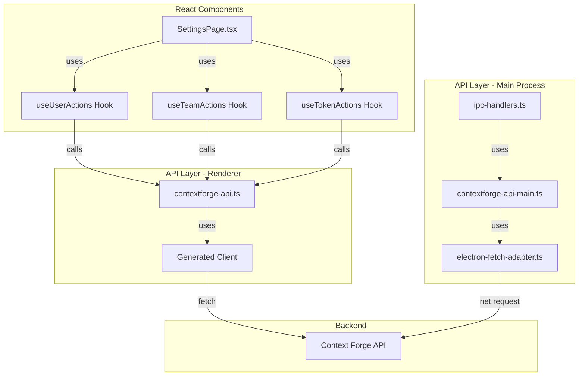

# Settings Page Integration Plan

## Executive Summary

This document outlines the comprehensive plan to integrate the Settings page with the generated API client. The Settings page currently uses mock data for three main sections: **Users**, **Teams**, and **API Tokens**. This integration will connect these sections to the real backend API using the auto-generated TypeScript client.

## Current State Analysis

### Settings Page Structure

The [`SettingsPage.tsx`](../src/components/SettingsPage.tsx) (1417 lines) contains:

1. **Users Section** - User account management
2. **Teams Section** - Team organization management  
3. **API Tokens Section** - Access token management

### Current Implementation Issues

- ❌ Uses hardcoded sample data (`sampleUsers`, `sampleTeams`, `sampleAPITokens`)
- ❌ No real API integration
- ❌ No error handling for API failures
- ❌ No loading states during operations
- ❌ Changes don't persist (in-memory only)

## API Type Mappings

### 1. Users Section

#### Current Interface (SettingsPage.tsx)
```typescript
interface User {
  id: number;
  fullName: string;
  email: string;
  role: 'Admin' | 'User';
  provider: 'Local';
  dateAdded: string;
}
```

#### Generated API Type ([`EmailUserResponse`](../src/lib/contextforge-client-ts/types.gen.ts:1662-1710))
```typescript
export type EmailUserResponse = {
  email: string;
  full_name?: string | null;
  is_admin: boolean;
  is_active: boolean;
  auth_provider: string;
  created_at: string;
  last_login?: string | null;
}
```

#### Type Mapping Strategy
```typescript
// Map API response to UI model
function mapUserFromApi(apiUser: EmailUserResponse): User {
  return {
    id: 0, // Not provided by API - use email as key instead
    fullName: apiUser.full_name || apiUser.email,
    email: apiUser.email,
    role: apiUser.is_admin ? 'Admin' : 'User',
    provider: apiUser.auth_provider as 'Local',
    dateAdded: new Date(apiUser.created_at).toISOString().split('T')[0]
  };
}
```

#### Available API Endpoints
- [`listUsersAuthEmailAdminUsersGet()`](../src/lib/contextforge-client-ts/sdk.gen.ts:2721) - List all users
- [`createUserAuthEmailAdminUsersPost()`](../src/lib/contextforge-client-ts/sdk.gen.ts:2752) - Create new user
- [`updateUserAuthEmailAdminUsersUserEmailPut()`](../src/lib/contextforge-client-ts/sdk.gen.ts:2851) - Update user
- [`deleteUserAuthEmailAdminUsersUserEmailDelete()`](../src/lib/contextforge-client-ts/sdk.gen.ts:2806) - Delete user

### 2. Teams Section

#### Current Interface (SettingsPage.tsx)
```typescript
interface Team {
  id: number;
  teamName: string;
  description: string;
  visibility: 'Public' | 'Private';
  maxMembers: number;
  creator: string;
  dateCreated: string;
}
```

#### Generated API Types
- [`TeamResponse`](../src/lib/contextforge-client-ts/types.gen.ts:5801-5874) - Team read model
- [`TeamCreateRequest`](../src/lib/contextforge-client-ts/types.gen.ts:5338-5369) - Team creation
- [`TeamUpdateRequest`](../src/lib/contextforge-client-ts/types.gen.ts:5895-5920) - Team updates

```typescript
export type TeamResponse = {
  id: string;
  name: string;
  slug: string;
  description?: string | null;
  created_by: string;
  is_personal: boolean;
  visibility: string | null;
  max_members?: number | null;
  member_count: number;
  created_at: string;
  updated_at: string;
  is_active: boolean;
}
```

#### Type Mapping Strategy
```typescript
function mapTeamFromApi(apiTeam: TeamResponse): Team {
  return {
    id: 0, // Use team.id (string UUID) as key instead
    teamName: apiTeam.name,
    description: apiTeam.description || '',
    visibility: apiTeam.visibility === 'public' ? 'Public' : 'Private',
    maxMembers: apiTeam.max_members || 50,
    creator: apiTeam.created_by,
    dateCreated: new Date(apiTeam.created_at).toISOString().split('T')[0]
  };
}
```

#### Available API Endpoints
- [`listTeamsTeamsGet()`](../src/lib/contextforge-client-ts/sdk.gen.ts:2926) - List teams
- [`createTeamTeamsPost()`](../src/lib/contextforge-client-ts/sdk.gen.ts:2952) - Create team
- [`updateTeamTeamsTeamIdPut()`](../src/lib/contextforge-client-ts/sdk.gen.ts:3023) - Update team
- [`deleteTeamTeamsTeamIdDelete()`](../src/lib/contextforge-client-ts/sdk.gen.ts:2978) - Delete team
- [`listTeamMembersTeamsTeamIdMembersGet()`](../src/lib/contextforge-client-ts/sdk.gen.ts:3048) - List team members

### 3. API Tokens Section

#### Current Interface (SettingsPage.tsx)
```typescript
interface APIToken {
  id: number;
  tokenName: string;
  expires: string;
  description: string;
  serverId: string;
  permissions: string[];
  dateCreated: string;
  lastUsed: string;
}
```

#### Generated API Types
- [`TokenResponse`](../src/lib/contextforge-client-ts/types.gen.ts:6067-6150) - Token read model
- [`TokenCreateRequest`](../src/lib/contextforge-client-ts/types.gen.ts:5944-5979) - Token creation
- [`TokenCreateResponse`](../src/lib/contextforge-client-ts/types.gen.ts:6005-6016) - Creation response with actual token

```typescript
export type TokenResponse = {
  id: string;
  name: string;
  description?: string | null;
  user_email: string;
  server_id?: string | null;
  resource_scopes: Array<string>;
  ip_restrictions: Array<string>;
  time_restrictions: { [key: string]: unknown };
  usage_limits: { [key: string]: unknown };
  created_at: string;
  expires_at?: string | null;
  last_used?: string | null;
  is_active: boolean;
  tags: Array<string>;
}
```

#### Type Mapping Strategy
```typescript
function mapTokenFromApi(apiToken: TokenResponse): APIToken {
  return {
    id: 0, // Use token.id (string UUID) as key instead
    tokenName: apiToken.name,
    expires: apiToken.expires_at 
      ? new Date(apiToken.expires_at).toISOString().split('T')[0]
      : 'Never',
    description: apiToken.description || '',
    serverId: apiToken.server_id || 'N/A',
    permissions: apiToken.resource_scopes,
    dateCreated: new Date(apiToken.created_at).toISOString().split('T')[0],
    lastUsed: apiToken.last_used 
      ? new Date(apiToken.last_used).toISOString().split('T')[0]
      : 'Never'
  };
}
```

#### Available API Endpoints
- [`listTokensTokensGet()`](../src/lib/contextforge-client-ts/sdk.gen.ts:3373) - List tokens
- [`createTokenTokensPost()`](../src/lib/contextforge-client-ts/sdk.gen.ts:3400) - Create token
- [`updateTokenTokensTokenIdPut()`](../src/lib/contextforge-client-ts/sdk.gen.ts:3478) - Update token
- [`revokeTokenTokensTokenIdDelete()`](../src/lib/contextforge-client-ts/sdk.gen.ts:3424) - Revoke/delete token

## Implementation Architecture

### Architecture Diagram



### Layer Responsibilities

#### 1. Component Layer (SettingsPage.tsx)
- **Responsibility**: UI rendering and user interactions
- **Changes Needed**:
  - Replace mock data with API calls via custom hooks
  - Add loading states during API operations
  - Add error handling and user feedback
  - Use toast notifications for success/error messages

#### 2. Custom Hooks Layer
- **Responsibility**: Encapsulate API logic and state management
- **Files to Create**:
  - `src/hooks/useUserActions.ts` - User CRUD operations
  - `src/hooks/useTeamActions.ts` - Team CRUD operations
  - `src/hooks/useTokenActions.ts` - Token CRUD operations

#### 3. API Wrapper Layer (Renderer)
- **Responsibility**: Provide typed API functions for renderer process
- **File**: [`src/lib/api/contextforge-api.ts`](../src/lib/api/contextforge-api.ts)
- **Changes Needed**: Add user, team, and token management functions

#### 4. API Wrapper Layer (Main Process)
- **Responsibility**: Provide typed API functions for main process
- **File**: `src/lib/api/contextforge-api-main.ts` (to be created)
- **Dependencies**: Electron fetch adapter for `net.request` compatibility

#### 5. IPC Layer
- **Responsibility**: Bridge renderer and main process
- **File**: [`src/ipc-handlers.ts`](../src/ipc-handlers.ts)
- **Changes Needed**: Add handlers for Settings operations

## Detailed Implementation Plan

### Phase 1: Foundation Setup

#### Step 1.1: Create Type Mapping Utilities
**File**: `src/lib/api/type-mappers.ts`

```typescript
import type { 
  EmailUserResponse, 
  TeamResponse, 
  TokenResponse 
} from '../contextforge-client-ts';

// User type mappings
export interface User {
  email: string; // Use email as primary key instead of numeric id
  fullName: string;
  role: 'Admin' | 'User';
  provider: string;
  dateAdded: string;
  isActive: boolean;
}

export function mapUserFromApi(apiUser: EmailUserResponse): User {
  return {
    email: apiUser.email,
    fullName: apiUser.full_name || apiUser.email,
    role: apiUser.is_admin ? 'Admin' : 'User',
    provider: apiUser.auth_provider,
    dateAdded: new Date(apiUser.created_at).toISOString().split('T')[0],
    isActive: apiUser.is_active
  };
}

// Team type mappings
export interface Team {
  id: string; // Use UUID from API
  teamName: string;
  description: string;
  visibility: 'Public' | 'Private';
  maxMembers: number;
  memberCount: number;
  creator: string;
  dateCreated: string;
}

export function mapTeamFromApi(apiTeam: TeamResponse): Team {
  return {
    id: apiTeam.id,
    teamName: apiTeam.name,
    description: apiTeam.description || '',
    visibility: apiTeam.visibility === 'public' ? 'Public' : 'Private',
    maxMembers: apiTeam.max_members || 50,
    memberCount: apiTeam.member_count,
    creator: apiTeam.created_by,
    dateCreated: new Date(apiTeam.created_at).toISOString().split('T')[0]
  };
}

// Token type mappings
export interface APIToken {
  id: string; // Use UUID from API
  tokenName: string;
  expires: string;
  description: string;
  serverId: string;
  permissions: string[];
  dateCreated: string;
  lastUsed: string;
  isActive: boolean;
}

export function mapTokenFromApi(apiToken: TokenResponse): APIToken {
  return {
    id: apiToken.id,
    tokenName: apiToken.name,
    expires: apiToken.expires_at 
      ? new Date(apiToken.expires_at).toISOString().split('T')[0]
      : 'Never',
    description: apiToken.description || '',
    serverId: apiToken.server_id || 'N/A',
    permissions: apiToken.resource_scopes,
    dateCreated: new Date(apiToken.created_at).toISOString().split('T')[0],
    lastUsed: apiToken.last_used 
      ? new Date(apiToken.last_used).toISOString().split('T')[0]
      : 'Never',
    isActive: apiToken.is_active
  };
}
```

#### Step 1.2: Extend Renderer API Wrapper
**File**: [`src/lib/api/contextforge-api.ts`](../src/lib/api/contextforge-api.ts)

Add the following functions:

```typescript
// User Management
import {
  listUsersAuthEmailAdminUsersGet,
  createUserAuthEmailAdminUsersPost,
  updateUserAuthEmailAdminUsersUserEmailPut,
  deleteUserAuthEmailAdminUsersUserEmailDelete,
  listTeamsTeamsGet,
  createTeamTeamsPost,
  updateTeamTeamsTeamIdPut,
  deleteTeamTeamsTeamIdDelete,
  listTokensTokensGet,
  createTokenTokensPost,
  updateTokenTokensTokenIdPut,
  revokeTokenTokensTokenIdDelete,
  type EmailUserResponse,
  type TeamResponse,
  type TeamCreateRequest,
  type TeamUpdateRequest,
  type TokenResponse,
  type TokenCreateRequest,
  type TokenUpdateRequest
} from '../contextforge-client-ts';

// Users
export async function listUsers() {
  const response = await listUsersAuthEmailAdminUsersGet();
  if (response.error) {
    throw new Error('Failed to list users: ' + JSON.stringify(response.error));
  }
  return response.data || [];
}

export async function createUser(userData: {
  email: string;
  password: string;
  full_name?: string;
  is_admin?: boolean;
}) {
  const response = await createUserAuthEmailAdminUsersPost({
    body: userData
  });
  if (response.error) {
    throw new Error('Failed to create user: ' + JSON.stringify(response.error));
  }
  return response.data;
}

export async function updateUser(email: string, userData: {
  full_name?: string;
  password?: string;
  is_admin?: boolean;
  is_active?: boolean;
}) {
  const response = await updateUserAuthEmailAdminUsersUserEmailPut({
    path: { user_email: email },
    body: userData
  });
  if (response.error) {
    throw new Error('Failed to update user: ' + JSON.stringify(response.error));
  }
  return response.data;
}

export async function deleteUser(email: string) {
  const response = await deleteUserAuthEmailAdminUsersUserEmailDelete({
    path: { user_email: email }
  });
  if (response.error) {
    throw new Error('Failed to delete user: ' + JSON.stringify(response.error));
  }
  return response.data;
}

// Teams
export async function listTeams() {
  const response = await listTeamsTeamsGet();
  if (response.error) {
    throw new Error('Failed to list teams: ' + JSON.stringify(response.error));
  }
  return response.data || [];
}

export async function createTeam(teamData: TeamCreateRequest) {
  const response = await createTeamTeamsPost({
    body: teamData
  });
  if (response.error) {
    throw new Error('Failed to create team: ' + JSON.stringify(response.error));
  }
  return response.data;
}

export async function updateTeam(teamId: string, teamData: TeamUpdateRequest) {
  const response = await updateTeamTeamsTeamIdPut({
    path: { team_id: teamId },
    body: teamData
  });
  if (response.error) {
    throw new Error('Failed to update team: ' + JSON.stringify(response.error));
  }
  return response.data;
}

export async function deleteTeam(teamId: string) {
  const response = await deleteTeamTeamsTeamIdDelete({
    path: { team_id: teamId }
  });
  if (response.error) {
    throw new Error('Failed to delete team: ' + JSON.stringify(response.error));
  }
  return response.data;
}

// Tokens
export async function listTokens() {
  const response = await listTokensTokensGet();
  if (response.error) {
    throw new Error('Failed to list tokens: ' + JSON.stringify(response.error));
  }
  return (response.data as any)?.tokens || [];
}

export async function createToken(tokenData: TokenCreateRequest) {
  const response = await createTokenTokensPost({
    body: tokenData
  });
  if (response.error) {
    throw new Error('Failed to create token: ' + JSON.stringify(response.error));
  }
  return response.data;
}

export async function updateToken(tokenId: string, tokenData: TokenUpdateRequest) {
  const response = await updateTokenTokensTokenIdPut({
    path: { token_id: tokenId },
    body: tokenData
  });
  if (response.error) {
    throw new Error('Failed to update token: ' + JSON.stringify(response.error));
  }
  return response.data;
}

export async function revokeToken(tokenId: string) {
  const response = await revokeTokenTokensTokenIdDelete({
    path: { token_id: tokenId }
  });
  if (response.error) {
    throw new Error('Failed to revoke token: ' + JSON.stringify(response.error));
  }
  return response.data;
}

// Type exports
export type { 
  EmailUserResponse, 
  TeamResponse, 
  TeamCreateRequest,
  TeamUpdateRequest,
  TokenResponse,
  TokenCreateRequest,
  TokenUpdateRequest
};
```

### Phase 2: Custom Hooks Creation

#### Step 2.1: User Actions Hook
**File**: `src/hooks/useUserActions.ts`

```typescript
import { useState, useCallback } from 'react';
import * as api from '../lib/api/contextforge-api';
import { mapUserFromApi, type User } from '../lib/api/type-mappers';
import { toastWithTray } from '../lib/toastWithTray';

export function useUserActions() {
  const [users, setUsers] = useState<User[]>([]);
  const [loading, setLoading] = useState(false);
  const [error, setError] = useState<string | null>(null);

  const loadUsers = useCallback(async () => {
    setLoading(true);
    setError(null);
    try {
      const apiUsers = await api.listUsers();
      const mappedUsers = apiUsers.map(mapUserFromApi);
      setUsers(mappedUsers);
    } catch (err) {
      const message = err instanceof Error ? err.message : 'Failed to load users';
      setError(message);
      toastWithTray('error', 'Error', message);
    } finally {
      setLoading(false);
    }
  }, []);

  const createUser = useCallback(async (userData: {
    fullName: string;
    email: string;
    password: string;
    role: 'Admin' | 'User';
  }) => {
    setLoading(true);
    setError(null);
    try {
      await api.createUser({
        email: userData.email,
        password: userData.password,
        full_name: userData.fullName,
        is_admin: userData.role === 'Admin'
      });
      toastWithTray('success', 'Success', `User ${userData.email} created successfully`);
      await loadUsers(); // Reload list
    } catch (err) {
      const message = err instanceof Error ? err.message : 'Failed to create user';
      setError(message);
      toastWithTray('error', 'Error', message);
      throw err;
    } finally {
      setLoading(false);
    }
  }, [loadUsers]);

  const updateUser = useCallback(async (
    email: string,
    userData: {
      fullName?: string;
      password?: string;
      role?: 'Admin' | 'User';
    }
  ) => {
    setLoading(true);
    setError(null);
    try {
      await api.updateUser(email, {
        full_name: userData.fullName,
        password: userData.password,
        is_admin: userData.role === 'Admin' ? true : userData.role === 'User' ? false : undefined
      });
      toastWithTray('success', 'Success', `User ${email} updated successfully`);
      await loadUsers(); // Reload list
    } catch (err) {
      const message = err instanceof Error ? err.message : 'Failed to update user';
      setError(message);
      toastWithTray('error', 'Error', message);
      throw err;
    } finally {
      setLoading(false);
    }
  }, [loadUsers]);

  const deleteUser = useCallback(async (email: string) => {
    setLoading(true);
    setError(null);
    try {
      await api.deleteUser(email);
      toastWithTray('success', 'Success', `User ${email} deleted successfully`);
      await loadUsers(); // Reload list
    } catch (err) {
      const message = err instanceof Error ? err.message : 'Failed to delete user';
      setError(message);
      toastWithTray('error', 'Error', message);
      throw err;
    } finally {
      setLoading(false);
    }
  }, [loadUsers]);

  return {
    users,
    loading,
    error,
    loadUsers,
    createUser,
    updateUser,
    deleteUser
  };
}
```

#### Step 2.2: Team Actions Hook
**File**: `src/hooks/useTeamActions.ts`

```typescript
import { useState, useCallback } from 'react';
import * as api from '../lib/api/contextforge-api';
import { mapTeamFromApi, type Team } from '../lib/api/type-mappers';
import { toastWithTray } from '../lib/toastWithTray';

export function useTeamActions() {
  const [teams, setTeams] = useState<Team[]>([]);
  const [loading, setLoading] = useState(false);
  const [error, setError] = useState<string | null>(null);

  const loadTeams = useCallback(async () => {
    setLoading(true);
    setError(null);
    try {
      const apiTeams = await api.listTeams();
      const mappedTeams = apiTeams.map(mapTeamFromApi);
      setTeams(mappedTeams);
    } catch (err) {
      const message = err instanceof Error ? err.message : 'Failed to load teams';
      setError(message);
      toastWithTray('error', 'Error', message);
    } finally {
      setLoading(false);
    }
  }, []);

  const createTeam = useCallback(async (teamData: {
    teamName: string;
    description: string;
    visibility: 'Public' | 'Private';
    maxMembers: number;
  }) => {
    setLoading(true);
    setError(null);
    try {
      await api.createTeam({
        name: teamData.teamName,
        description: teamData.description,
        visibility: teamData.visibility.toLowerCase() as 'public' | 'private',
        max_members: teamData.maxMembers
      });
      toastWithTray('success', 'Success', `Team ${teamData.teamName} created successfully`);
      await loadTeams();
    } catch (err) {
      const message = err instanceof Error ? err.message : 'Failed to create team';
      setError(message);
      toastWithTray('error', 'Error', message);
      throw err;
    } finally {
      setLoading(false);
    }
  }, [loadTeams]);

  const updateTeam = useCallback(async (
    teamId: string,
    teamData: {
      teamName?: string;
      description?: string;
      visibility?: 'Public' | 'Private';
      maxMembers?: number;
    }
  ) => {
    setLoading(true);
    setError(null);
    try {
      await api.updateTeam(teamId, {
        name: teamData.teamName,
        description: teamData.description,
        visibility: teamData.visibility?.toLowerCase() as 'public' | 'private' | undefined,
        max_members: teamData.maxMembers
      });
      toastWithTray('success', 'Success', `Team updated successfully`);
      await loadTeams();
    } catch (err) {
      const message = err instanceof Error ? err.message : 'Failed to update team';
      setError(message);
      toastWithTray('error', 'Error', message);
      throw err;
    } finally {
      setLoading(false);
    }
  }, [loadTeams]);

  const deleteTeam = useCallback(async (teamId: string) => {
    setLoading(true);
    setError(null);
    try {
      await api.deleteTeam(teamId);
      toastWithTray('success', 'Success', `Team deleted successfully`);
      await loadTeams();
    } catch (err) {
      const message = err instanceof Error ? err.message : 'Failed to delete team';
      setError(message);
      toastWithTray('error', 'Error', message);
      throw err;
    } finally {
      setLoading(false);
    }
  }, [loadTeams]);

  return {
    teams,
    loading,
    error,
    loadTeams,
    createTeam,
    updateTeam,
    deleteTeam
  };
}
```

#### Step 2.3: Token Actions Hook
**File**: `src/hooks/useTokenActions.ts`

```typescript
import { useState, useCallback } from 'react';
import * as api from '../lib/api/contextforge-api';
import { mapTokenFromApi, type APIToken } from '../lib/api/type-mappers';
import { toastWithTray } from '../lib/toastWithTray';

export function useTokenActions() {
  const [tokens, setTokens] = useState<APIToken[]>([]);
  const [loading, setLoading] = useState(false);
  const [error, setError] = useState<string | null>(null);

  const loadTokens = useCallback(async () => {
    setLoading(true);
    setError(null);
    try {
      const apiTokens = await api.listTokens();
      const mappedTokens = apiTokens.map(mapTokenFromApi);
      setTokens(mappedTokens);
    } catch (err) {
      const message = err instanceof Error ? err.message : 'Failed to load tokens';
      setError(message);
      toastWithTray('error', 'Error', message);
    } finally {
      setLoading(false);
    }
  }, []);

  const createToken = useCallback(async (tokenData: {
    tokenName: string;
    description: string;
    expiresInDays: number;
    permissions: string[];
  }) => {
    setLoading(true);
    setError(null);
    try {
      const response = await api.createToken({
        name: tokenData.tokenName,
        description: tokenData.description,
        expires_in_days: tokenData.expiresInDays,
        scope: {
          resource_scopes: tokenData.permissions
        }
      });
      
      // Show the actual token to user (only shown once!)
      const actualToken = (response as any)?.access_token;
      if (actualToken) {
        toastWithTray('success', 'Token Created', 
          `Token created successfully. Save this token: ${actualToken.substring(0, 20)}...`);
      } else {
        toastWithTray('success', 'Success', `Token ${tokenData.tokenName} created successfully`);
      }
      
      await loadTokens();
      return response;
    } catch (err) {
      const message = err instanceof Error ? err.message : 'Failed to create token';
      setError(message);
      toastWithTray('error', 'Error', message);
      throw err;
    } finally {
      setLoading(false);
    }
  }, [loadTokens]);

  const updateToken = useCallback(async (
    tokenId: string,
    tokenData: {
      tokenName?: string;
      description?: string;
    }
  ) => {
    setLoading(true);
    setError(null);
    try {
      await api.updateToken(tokenId, {
        name: tokenData.tokenName,
        description: tokenData.description
      });
      toastWithTray('success', 'Success', `Token updated successfully`);
      await loadTokens();
    } catch (err) {
      const message = err instanceof Error ? err.message : 'Failed to update token';
      setError(message);
      toastWithTray('error', 'Error', message);
      throw err;
    } finally {
      setLoading(false);
    }
  }, [loadTokens]);

  const revokeToken = useCallback(async (tokenId: string) => {
    setLoading(true);
    setError(null);
    try {
      await api.revokeToken(tokenId);
      toastWithTray('success', 'Success', `Token revoked successfully`);
      await loadTokens();
    } catch (err) {
      const message = err instanceof Error ? err.message : 'Failed to revoke token';
      setError(message);
      toastWithTray('error', 'Error', message);
      throw err;
    } finally {
      setLoading(false);
    }
  }, [loadTokens]);

  return {
    tokens,
    loading,
    error,
    loadTokens,
    createToken,
    updateToken,
    revokeToken
  };
}
```

### Phase 3: SettingsPage Integration

#### Step 3.1: Update SettingsPage Component

Key changes to [`SettingsPage.tsx`](../src/components/SettingsPage.tsx):

1. **Import custom hooks**:
```typescript
import { useUserActions } from '../hooks/useUserActions';
import { useTeamActions } from '../hooks/useTeamActions';
import { useTokenActions } from '../hooks/useTokenActions';
```

2. **Replace state management**:
```typescript
// Remove these:
// const [usersData, setUsersData] = useState<User[]>(sampleUsers);
// const [teamsData, setTeamsData] = useState<Team[]>(sampleTeams);
// const [apiTokensData, setApiTokensData] = useState<APIToken[]>(sampleAPITokens);

// Add these:
const { 
  users: usersData, 
  loading: usersLoading, 
  loadUsers, 
  createUser, 
  updateUser, 
  deleteUser 
} = useUserActions();

const { 
  teams: teamsData, 
  loading: teamsLoading, 
  loadTeams, 
  createTeam, 
  updateTeam, 
  deleteTeam 
} = useTeamActions();

const { 
  tokens: apiTokensData, 
  loading: tokensLoading, 
  loadTokens, 
  createToken, 
  updateToken, 
  revokeToken 
} = useTokenActions();
```

3. **Add useEffect to load data**:
```typescript
useEffect(() => {
  loadUsers();
  loadTeams();
  loadTokens();
}, [loadUsers, loadTeams, loadTokens]);
```

4. **Update handler functions**:
```typescript
const handleAddUser = async () => {
  if (newUserData.fullName && newUserData.email && newUserData.password) {
    try {
      await createUser(newUserData);
      setNewUserData({ fullName: '', email: '', password: '', role: 'User' });
      setShowAddUserForm(false);
    } catch (err) {
      // Error already handled by hook
    }
  }
};

const handleSaveEditUser = async () => {
  if (editingUser && editUserData.fullName && editUserData.email) {
    try {
      await updateUser(editingUser.email, editUserData);
      setEditingUser(null);
      setEditUserData({ fullName: '', email: '', password: '', role: 'User' });
    } catch (err) {
      // Error already handled by hook
    }
  }
};

// Similar updates for team and token handlers...
```

5. **Add loading indicators**:
```typescript
{usersLoading && (
  <div className="flex justify-center p-4">
    <div className="animate-spin rounded-full h-8 w-8 border-b-2 border-blue-500"></div>
  </div>
)}
```

### Phase 4: Main Process Integration (Optional but Recommended)

#### Step 4.1: Create Electron Fetch Adapter
**File**: `src/lib/api/electron-fetch-adapter.ts`

This adapter allows the generated client to work in Electron's main process by wrapping `net.request()` with a fetch-compatible interface.

```typescript
import { net } from 'electron';

export function createElectronFetchAdapter(): typeof fetch {
  return async (input: RequestInfo | URL, init?: RequestInit): Promise<Response> => {
    const url = input instanceof Request ? input.url : input.toString();
    const method = init?.method || 'GET';
    const headers = new Headers(init?.headers);
    
    return new Promise((resolve, reject) => {
      const request = net.request({ method, url });
      
      headers.forEach((value, key) => {
        request.setHeader(key, value);
      });
      
      let responseData = '';
      let statusCode = 0;
      let responseHeaders: Record<string, string> = {};
      
      request.on('response', (response) => {
        statusCode = response.statusCode;
        responseHeaders = response.headers as Record<string, string>;
        
        response.on('data', (chunk) => {
          responseData += chunk.toString();
        });
        
        response.on('end', () => {
          const fetchResponse = new Response(responseData, {
            status: statusCode,
            statusText: getStatusText(statusCode),
            headers: new Headers(responseHeaders),
          });
          resolve(fetchResponse);
        });
      });
      
      request.on('error', (error) => {
        reject(error);
      });
      
      if (init?.body) {
        request.write(init.body as string);
      }
      
      request.end();
    });
  };
}

function getStatusText(status: number): string {
  const statusTexts: Record<number, string> = {
    200: 'OK',
    201: 'Created',
    204: 'No Content',
    400: 'Bad Request',
    401: 'Unauthorized',
    403: 'Forbidden',
    404: 'Not Found',
    500: 'Internal Server Error',
  };
  return statusTexts[status] || 'Unknown';
}
```

#### Step 4.2: Create Main Process API Wrapper
**File**: `src/lib/api/contextforge-api-main.ts`

```typescript
import { client } from '../contextforge-client-ts/client.gen';
import { createElectronFetchAdapter } from './electron-fetch-adapter';
import * as api from './contextforge-api'; // Reuse all the functions

const API_BASE_URL = 'http://localhost:4444';
const electronFetch = createElectronFetchAdapter();

export function configureMainClient(token?: string) {
  client.setConfig({
    baseUrl: API_BASE_URL,
    fetch: electronFetch as any,
    headers: token ? {
      'Authorization': `Bearer ${token}`
    } : {}
  });
}

// Initialize on module load
configureMainClient();

// Re-export all API functions
export * from './contextforge-api';
```

#### Step 4.3: Update IPC Handlers
**File**: [`src/ipc-handlers.ts`](../src/ipc-handlers.ts)

Add handlers for Settings operations:

```typescript
import * as mainApi from './lib/api/contextforge-api-main';

// User management handlers
ipcMain.handle('api:list-users', async () => {
  try {
    const users = await mainApi.listUsers();
    return { success: true, data: users };
  } catch (error) {
    return { success: false, error: (error as Error).message };
  }
});

ipcMain.handle('api:create-user', async (_event, userData) => {
  try {
    const user = await mainApi.createUser(userData);
    return { success: true, data: user };
  } catch (error) {
    return { success: false, error: (error as Error).message };
  }
});

ipcMain.handle('api:update-user', async (_event, email, userData) => {
  try {
    const user = await mainApi.updateUser(email, userData);
    return { success: true, data: user };
  } catch (error) {
    return { success: false, error: (error as Error).message };
  }
});

ipcMain.handle('api:delete-user', async (_event, email) => {
  try {
    await mainApi.deleteUser(email);
    return { success: true };
  } catch (error) {
    return { success: false, error: (error as Error).message };
  }
});

// Team management handlers
ipcMain.handle('api:list-teams', async () => {
  try {
    const teams = await mainApi.listTeams();
    return { success: true, data: teams };
  } catch (error) {
    return { success: false, error: (error as Error).message };
  }
});

ipcMain.handle('api:create-team', async (_event, teamData) => {
  try {
    const team = await mainApi.createTeam(teamData);
    return { success: true, data: team };
  } catch (error) {
    return { success: false, error: (error as Error).message };
  }
});

ipcMain.handle('api:update-team', async (_event, teamId, teamData) => {
  try {
    const team = await mainApi.updateTeam(teamId, teamData);
    return { success: true, data: team };
  } catch (error) {
    return { success: false, error: (error as Error).message };
  }
});

ipcMain.handle('api:delete-team', async (_event, teamId) => {
  try {
    await mainApi.deleteTeam(teamId);
    return { success: true };
  } catch (error) {
    return { success: false, error: (error as Error).message };
  }
});

// Token management handlers
ipcMain.handle('api:list-tokens', async () => {
  try {
    const tokens = await mainApi.listTokens();
    return { success: true, data: tokens };
  } catch (error) {
    return { success: false, error: (error as Error).message };
  }
});

ipcMain.handle('api:create-token', async (_event, tokenData) => {
  try {
    const token = await mainApi.createToken(tokenData);
    return { success: true, data: token };
  } catch (error) {
    return { success: false, error: (error as Error).message };
  }
});

ipcMain.handle('api:update-token', async (_event, tokenId, tokenData) => {
  try {
    const token = await mainApi.updateToken(tokenId, tokenData);
    return { success: true, data: token };
  } catch (error) {
    return { success: false, error: (error as Error).message };
  }
});

ipcMain.handle('api:revoke-token', async (_event, tokenId) => {
  try {
    await mainApi.revokeToken(tokenId);
    return { success: true };
  } catch (error) {
    return { success: false, error: (error as Error).message };
  }
});
```

## Testing Strategy

### Unit Testing
1. Test type mapping functions with various API responses
2. Test custom hooks with mocked API calls
3. Test error handling in hooks

### Integration Testing
1. Test full CRUD operations for each section
2. Test loading states and error states
3. Test toast notifications
4. Test data refresh after operations

### End-to-End Testing
1. Test complete user workflows:
   - Create, edit, delete user
   - Create, edit, delete team
   - Create, revoke token
2. Test error scenarios (network failures, validation errors)
3. Test concurrent operations

## Migration Checklist

### Phase 1: Foundation
- [ ] Create `src/lib/api/type-mappers.ts`
- [ ] Extend `src/lib/api/contextforge-api.ts` with user/team/token functions
- [ ] Test API functions in isolation

### Phase 2: Custom Hooks
- [ ] Create `src/hooks/useUserActions.ts`
- [ ] Create `src/hooks/useTeamActions.ts`
- [ ] Create `src/hooks/useTokenActions.ts`
- [ ] Test hooks with mocked API

### Phase 3: Component Integration
- [ ] Update `SettingsPage.tsx` to use custom hooks
- [ ] Replace mock data with API calls
- [ ] Add loading states
- [ ] Add error handling
- [ ] Add toast notifications
- [ ] Test in development

### Phase 4: Main Process (Optional)
- [ ] Create `src/lib/api/electron-fetch-adapter.ts`
- [ ] Create `src/lib/api/contextforge-api-main.ts`
- [ ] Update `src/ipc-handlers.ts`
- [ ] Test IPC communication

### Phase 5: Testing & Deployment
- [ ] Write unit tests
- [ ] Write integration tests
- [ ] Perform manual testing
- [ ] Update documentation
- [ ] Deploy to production

## Key Considerations

### 1. Authentication
- All API endpoints require authentication via bearer token
- Token is stored in localStorage and configured on client initialization
- Handle 401 errors by redirecting to login

### 2. Error Handling
- All API errors are caught and displayed via toast notifications
- Loading states prevent duplicate operations
- Optimistic updates can be added for better UX

### 3. Data Consistency
- Always reload data after mutations to ensure consistency
- Consider adding optimistic updates for better perceived performance
- Handle race conditions in concurrent operations

### 4. Type Safety
- Use generated types from API client
- Create mapping functions for UI-specific types
- Leverage TypeScript for compile-time safety

### 5. Performance
- Consider pagination for large lists
- Add debouncing for search/filter operations
- Cache data when appropriate

## Benefits of This Approach

1. **Type Safety**: Full TypeScript types from OpenAPI spec
2. **Maintainability**: Auto-generated client updates automatically
3. **Consistency**: Same API interface across renderer and main process
4. **Error Handling**: Centralized error handling in hooks
5. **User Feedback**: Toast notifications for all operations
6. **Code Reuse**: Shared API functions and type mappers
7. **Testability**: Hooks can be tested independently

## Next Steps

1. Review and approve this plan
2. Begin implementation starting with Phase 1
3. Test each phase before moving to the next
4. Update documentation as implementation progresses
5. Consider adding more advanced features (pagination, search, filters)

## References

- [Generated Client Analysis](./generated-client-analysis.md)
- [SettingsPage Component](../src/components/SettingsPage.tsx)
- [Generated API Client](../src/lib/contextforge-client-ts/)
- [Current API Wrapper](../src/lib/api/contextforge-api.ts)