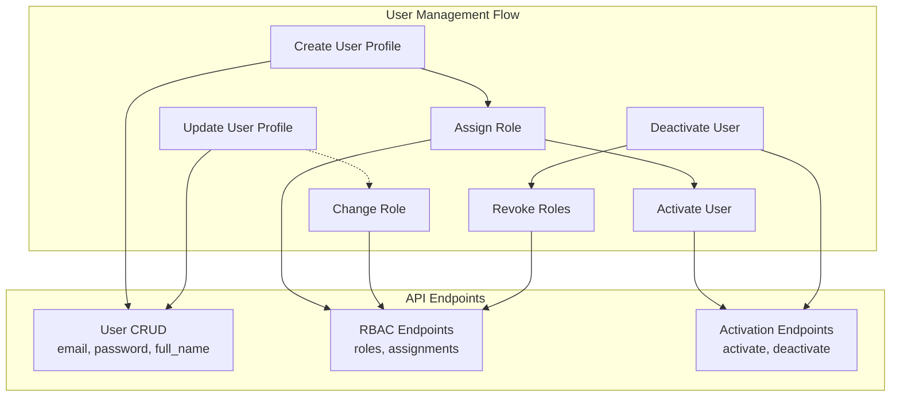

# Settings Page Integration Plan with RBAC Support

## Executive Summary

This document outlines the complete integration plan for the Settings page with the Context Forge API, including full Role-Based Access Control (RBAC) support. The backend uses a sophisticated RBAC system where user roles are managed separately from user profiles, requiring a multi-step approach for user management.

**Key Discovery**: The API separates user profile management from role management:
- User CRUD operations handle only basic profile data (email, password, full_name)
- User roles are managed through dedicated RBAC endpoints
- User activation/deactivation uses separate endpoints

## Current State

### Completed Infrastructure
✅ **IPC Layer**: Added RBAC method definitions to [`preload.ts`](../src/preload.ts:62-68)
✅ **IPC Handlers**: Implemented RBAC handlers in [`ipc-handlers.ts`](../src/ipc-handlers.ts:313-371)
✅ **Main Process API**: Added RBAC functions to [`contextforge-api-main.ts`](../src/lib/api/contextforge-api-main.ts:1-50)
✅ **Renderer IPC Wrapper**: Added RBAC functions to [`contextforge-api-ipc.ts`](../src/lib/api/contextforge-api-ipc.ts:443-523)

### Pending Work
- Type mapping utilities with RBAC support
- Custom hooks for user/team/token management
- SettingsPage component integration
- Error handling and loading states
- Toast notifications

## API Architecture Analysis

### RBAC System Overview



### Key API Types

#### 1. User Management Types

**EmailUserResponse** (from API):
```typescript
export type EmailUserResponse = {
  email: string;
  full_name?: string | null;
  is_admin: boolean;        // Deprecated - use RBAC instead
  is_active: boolean;
  auth_provider: string;
  created_at: string;
  last_login?: string | null;
}
```

**EmailRegistrationRequest** (for create/update):
```typescript
export type EmailRegistrationRequest = {
  email: string;
  password: string;
  full_name?: string | null;
  // Note: No is_admin field - use RBAC endpoints instead
}
```

#### 2. RBAC Types

**RoleResponse**:
```typescript
export type RoleResponse = {
  id: string;
  name: string;
  description?: string | null;
  scope: string;                          // 'global', 'team', etc.
  permissions: Array<string>;
  effective_permissions?: Array<string> | null;
  inherits_from?: string | null;
  created_by: string;
  is_system_role: boolean;
  is_active: boolean;
  created_at: string;
  updated_at: string;
}
```

**UserRoleResponse**:
```typescript
export type UserRoleResponse = {
  id: string;
  user_email: string;
  role_id: string;
  role_name?: string | null;
  scope: string;
  scope_id?: string | null;
  granted_by: string;
  granted_at: string;
  expires_at?: string | null;
  is_active: boolean;
}
```

**UserRoleAssignRequest**:
```typescript
export type UserRoleAssignRequest = {
  role_id: string;
  scope?: string | null;
  scope_id?: string | null;
  expires_at?: string | null;
}
```

#### 3. Available RBAC Endpoints

From [`sdk.gen.ts`](../src/lib/contextforge-client-ts/sdk.gen.ts:3600-3850):

**Role Management**:
- `listRolesRbacRolesGet()` - List all roles
- `createRoleRbacRolesPost()` - Create new role
- `getRoleRbacRolesRoleIdGet()` - Get role details
- `updateRoleRbacRolesRoleIdPut()` - Update role
- `deleteRoleRbacRolesRoleIdDelete()` - Delete role

**User Role Assignment**:
- `getUserRolesRbacUsersUserEmailRolesGet()` - Get user's roles
- `assignRoleToUserRbacUsersUserEmailRolesPost()` - Assign role to user
- `revokeUserRoleRbacUsersUserEmailRolesRoleIdDelete()` - Revoke user's role

**User Activation**:
- `adminActivateUserAdminUsersUserEmailActivatePost()` - Activate user
- `adminDeactivateUserAdminUsersUserEmailDeactivatePost()` - Deactivate user

## Implementation Plan

### Phase 1: Type Mapping Utilities

Create [`src/lib/api/type-mappers.ts`](../src/lib/api/type-mappers.ts:1) with RBAC-aware mappings:

```typescript
import type { 
  EmailUserResponse, 
  RoleResponse, 
  UserRoleResponse 
} from '../contextforge-client-ts/types.gen';

// UI Model for Settings Page
export interface User {
  email: string;
  fullName: string;
  role: 'Admin' | 'User';  // Simplified for UI
  roles: UserRoleResponse[]; // Full RBAC roles
  provider: string;
  dateAdded: string;
  isActive: boolean;
}

// Map API response to UI model
export function mapUserFromApi(
  apiUser: EmailUserResponse,
  userRoles: UserRoleResponse[] = []
): User {
  // Determine if user has admin role from RBAC
  const hasAdminRole = userRoles.some(
    role => role.role_name?.toLowerCase().includes('admin') && role.is_active
  );
  
  return {
    email: apiUser.email,
    fullName: apiUser.full_name || apiUser.email,
    role: hasAdminRole ? 'Admin' : 'User',
    roles: userRoles,
    provider: apiUser.auth_provider,
    dateAdded: new Date(apiUser.created_at).toISOString().split('T')[0],
    isActive: apiUser.is_active
  };
}

// Map UI model to API request
export function mapUserToApiRequest(user: Partial<User>) {
  return {
    email: user.email,
    password: user.password, // Only for creation
    full_name: user.fullName
    // Note: Role is handled separately via RBAC endpoints
  };
}

// Helper to find admin role ID
export function findAdminRoleId(roles: RoleResponse[]): string | null {
  const adminRole = roles.find(
    role => role.name.toLowerCase().includes('admin') && 
            role.is_active &&
            role.scope === 'global'
  );
  return adminRole?.id || null;
}
```

### Phase 2: Custom Hooks with RBAC

#### Hook 1: useUserActions

Create [`src/hooks/useUserActions.ts`](../src/hooks/useUserActions.ts:1):

```typescript
import { useState, useCallback } from 'react';
import * as api from '../lib/api/contextforge-api-ipc';
import { mapUserFromApi, findAdminRoleId } from '../lib/api/type-mappers';
import type { User } from '../lib/api/type-mappers';
import { toastWithTray } from '../lib/toastWithTray';

export function useUserActions() {
  const [users, setUsers] = useState<User[]>([]);
  const [roles, setRoles] = useState<RoleResponse[]>([]);
  const [loading, setLoading] = useState(false);
  const [error, setError] = useState<string | null>(null);

  // Load all users with their roles
  const loadUsers = useCallback(async () => {
    setLoading(true);
    setError(null);
    try {
      // Load users and roles in parallel
      const [usersData, rolesData] = await Promise.all([
        api.listUsers(),
        api.listRoles()
      ]);
      
      setRoles(rolesData);
      
      // Load roles for each user
      const usersWithRoles = await Promise.all(
        usersData.map(async (user) => {
          const userRoles = await api.getUserRoles(user.email);
          return mapUserFromApi(user, userRoles);
        })
      );
      
      setUsers(usersWithRoles);
    } catch (err) {
      const message = err instanceof Error ? err.message : 'Failed to load users';
      setError(message);
      toastWithTray.error('Error', message);
    } finally {
      setLoading(false);
    }
  }, []);

  // Create user with role assignment
  const createUser = useCallback(async (userData: {
    email: string;
    password: string;
    fullName: string;
    role: 'Admin' | 'User';
  }) => {
    setLoading(true);
    setError(null);
    try {
      // Step 1: Create user profile
      const newUser = await api.createUser({
        email: userData.email,
        password: userData.password,
        full_name: userData.fullName
      });
      
      // Step 2: Assign role if Admin
      if (userData.role === 'Admin') {
        const adminRoleId = findAdminRoleId(roles);
        if (adminRoleId) {
          await api.assignRoleToUser(userData.email, adminRoleId);
        }
      }
      
      // Step 3: Activate user
      await api.activateUser(userData.email);
      
      // Reload users to get updated list
      await loadUsers();
      
      toastWithTray.success('Success', `User ${userData.email} created`);
    } catch (err) {
      const message = err instanceof Error ? err.message : 'Failed to create user';
      setError(message);
      toastWithTray.error('Error', message);
      throw err;
    } finally {
      setLoading(false);
    }
  }, [roles, loadUsers]);

  // Update user with role management
  const updateUser = useCallback(async (
    email: string,
    updates: {
      fullName?: string;
      role?: 'Admin' | 'User';
    }
  ) => {
    setLoading(true);
    setError(null);
    try {
      // Step 1: Update profile if needed
      if (updates.fullName) {
        await api.updateUser(email, {
          full_name: updates.fullName
        });
      }
      
      // Step 2: Update role if changed
      if (updates.role) {
        const currentUser = users.find(u => u.email === email);
        if (currentUser && currentUser.role !== updates.role) {
          const adminRoleId = findAdminRoleId(roles);
          
          if (updates.role === 'Admin' && adminRoleId) {
            // Assign admin role
            await api.assignRoleToUser(email, adminRoleId);
          } else if (updates.role === 'User' && adminRoleId) {
            // Revoke admin role
            const adminAssignment = currentUser.roles.find(
              r => r.role_id === adminRoleId
            );
            if (adminAssignment) {
              await api.revokeRoleFromUser(email, adminRoleId);
            }
          }
        }
      }
      
      await loadUsers();
      toastWithTray.success('Success', `User ${email} updated`);
    } catch (err) {
      const message = err instanceof Error ? err.message : 'Failed to update user';
      setError(message);
      toastWithTray.error('Error', message);
      throw err;
    } finally {
      setLoading(false);
    }
  }, [users, roles, loadUsers]);

  // Delete user
  const deleteUser = useCallback(async (email: string) => {
    setLoading(true);
    setError(null);
    try {
      await api.deleteUser(email);
      await loadUsers();
      toastWithTray.success('Success', `User ${email} deleted`);
    } catch (err) {
      const message = err instanceof Error ? err.message : 'Failed to delete user';
      setError(message);
      toastWithTray.error('Error', message);
      throw err;
    } finally {
      setLoading(false);
    }
  }, [loadUsers]);

  // Toggle user active status
  const toggleUserStatus = useCallback(async (email: string, activate: boolean) => {
    setLoading(true);
    setError(null);
    try {
      if (activate) {
        await api.activateUser(email);
      } else {
        await api.deactivateUser(email);
      }
      await loadUsers();
      toastWithTray.success(
        'Success', 
        `User ${email} ${activate ? 'activated' : 'deactivated'}`
      );
    } catch (err) {
      const message = err instanceof Error ? err.message : 'Failed to update user status';
      setError(message);
      toastWithTray.error('Error', message);
      throw err;
    } finally {
      setLoading(false);
    }
  }, [loadUsers]);

  return {
    users,
    roles,
    loading,
    error,
    loadUsers,
    createUser,
    updateUser,
    deleteUser,
    toggleUserStatus
  };
}
```

#### Hook 2: useTeamActions

Create [`src/hooks/useTeamActions.ts`](../src/hooks/useTeamActions.ts:1):

```typescript
import { useState, useCallback } from 'react';
import * as api from '../lib/api/contextforge-api-ipc';
import { toastWithTray } from '../lib/toastWithTray';

export interface Team {
  id: string;
  teamName: string;
  description: string;
  visibility: 'Public' | 'Private';
  maxMembers: number;
  creator: string;
  dateCreated: string;
}

export function useTeamActions() {
  const [teams, setTeams] = useState<Team[]>([]);
  const [loading, setLoading] = useState(false);
  const [error, setError] = useState<string | null>(null);

  const loadTeams = useCallback(async () => {
    setLoading(true);
    setError(null);
    try {
      const data = await api.listTeams();
      // Map API response to UI model
      const mappedTeams = data.map(team => ({
        id: team.id,
        teamName: team.name,
        description: team.description || '',
        visibility: team.visibility === 'public' ? 'Public' : 'Private',
        maxMembers: team.max_members || 0,
        creator: team.created_by,
        dateCreated: new Date(team.created_at).toISOString().split('T')[0]
      }));
      setTeams(mappedTeams);
    } catch (err) {
      const message = err instanceof Error ? err.message : 'Failed to load teams';
      setError(message);
      toastWithTray.error('Error', message);
    } finally {
      setLoading(false);
    }
  }, []);

  const createTeam = useCallback(async (teamData: Omit<Team, 'id' | 'creator' | 'dateCreated'>) => {
    setLoading(true);
    setError(null);
    try {
      await api.createTeam({
        name: teamData.teamName,
        description: teamData.description,
        visibility: teamData.visibility.toLowerCase(),
        max_members: teamData.maxMembers
      });
      await loadTeams();
      toastWithTray.success('Success', `Team ${teamData.teamName} created`);
    } catch (err) {
      const message = err instanceof Error ? err.message : 'Failed to create team';
      setError(message);
      toastWithTray.error('Error', message);
      throw err;
    } finally {
      setLoading(false);
    }
  }, [loadTeams]);

  const updateTeam = useCallback(async (teamId: string, updates: Partial<Team>) => {
    setLoading(true);
    setError(null);
    try {
      await api.updateTeam(teamId, {
        name: updates.teamName,
        description: updates.description,
        visibility: updates.visibility?.toLowerCase(),
        max_members: updates.maxMembers
      });
      await loadTeams();
      toastWithTray.success('Success', 'Team updated');
    } catch (err) {
      const message = err instanceof Error ? err.message : 'Failed to update team';
      setError(message);
      toastWithTray.error('Error', message);
      throw err;
    } finally {
      setLoading(false);
    }
  }, [loadTeams]);

  const deleteTeam = useCallback(async (teamId: string) => {
    setLoading(true);
    setError(null);
    try {
      await api.deleteTeam(teamId);
      await loadTeams();
      toastWithTray.success('Success', 'Team deleted');
    } catch (err) {
      const message = err instanceof Error ? err.message : 'Failed to delete team';
      setError(message);
      toastWithTray.error('Error', message);
      throw err;
    } finally {
      setLoading(false);
    }
  }, [loadTeams]);

  return {
    teams,
    loading,
    error,
    loadTeams,
    createTeam,
    updateTeam,
    deleteTeam
  };
}
```

#### Hook 3: useTokenActions

Create [`src/hooks/useTokenActions.ts`](../src/hooks/useTokenActions.ts:1):

```typescript
import { useState, useCallback } from 'react';
import * as api from '../lib/api/contextforge-api-ipc';
import { toastWithTray } from '../lib/toastWithTray';

export interface APIToken {
  id: string;
  tokenName: string;
  expires: string;
  description: string;
  serverId: string;
  permissions: string[];
  dateCreated: string;
  lastUsed: string;
}

export function useTokenActions() {
  const [tokens, setTokens] = useState<APIToken[]>([]);
  const [loading, setLoading] = useState(false);
  const [error, setError] = useState<string | null>(null);

  const loadTokens = useCallback(async () => {
    setLoading(true);
    setError(null);
    try {
      const data = await api.listTokens();
      // Map API response to UI model
      const mappedTokens = data.map(token => ({
        id: token.id,
        tokenName: token.name,
        expires: token.expires_at || 'Never',
        description: token.description || '',
        serverId: token.server_id || '',
        permissions: token.scopes || [],
        dateCreated: new Date(token.created_at).toISOString().split('T')[0],
        lastUsed: token.last_used_at 
          ? new Date(token.last_used_at).toISOString().split('T')[0]
          : 'Never'
      }));
      setTokens(mappedTokens);
    } catch (err) {
      const message = err instanceof Error ? err.message : 'Failed to load tokens';
      setError(message);
      toastWithTray.error('Error', message);
    } finally {
      setLoading(false);
    }
  }, []);

  const createToken = useCallback(async (tokenData: Omit<APIToken, 'id' | 'dateCreated' | 'lastUsed'>) => {
    setLoading(true);
    setError(null);
    try {
      await api.createToken({
        name: tokenData.tokenName,
        description: tokenData.description,
        expires_at: tokenData.expires !== 'Never' ? tokenData.expires : null,
        scopes: tokenData.permissions
      });
      await loadTokens();
      toastWithTray.success('Success', `Token ${tokenData.tokenName} created`);
    } catch (err) {
      const message = err instanceof Error ? err.message : 'Failed to create token';
      setError(message);
      toastWithTray.error('Error', message);
      throw err;
    } finally {
      setLoading(false);
    }
  }, [loadTokens]);

  const updateToken = useCallback(async (tokenId: string, updates: Partial<APIToken>) => {
    setLoading(true);
    setError(null);
    try {
      await api.updateToken(tokenId, {
        name: updates.tokenName,
        description: updates.description,
        expires_at: updates.expires !== 'Never' ? updates.expires : null,
        scopes: updates.permissions
      });
      await loadTokens();
      toastWithTray.success('Success', 'Token updated');
    } catch (err) {
      const message = err instanceof Error ? err.message : 'Failed to update token';
      setError(message);
      toastWithTray.error('Error', message);
      throw err;
    } finally {
      setLoading(false);
    }
  }, [loadTokens]);

  const revokeToken = useCallback(async (tokenId: string) => {
    setLoading(true);
    setError(null);
    try {
      await api.revokeToken(tokenId);
      await loadTokens();
      toastWithTray.success('Success', 'Token revoked');
    } catch (err) {
      const message = err instanceof Error ? err.message : 'Failed to revoke token';
      setError(message);
      toastWithTray.error('Error', message);
      throw err;
    } finally {
      setLoading(false);
    }
  }, [loadTokens]);

  return {
    tokens,
    loading,
    error,
    loadTokens,
    createToken,
    updateToken,
    revokeToken
  };
}
```

### Phase 3: SettingsPage Integration

Update [`src/components/SettingsPage.tsx`](../src/components/SettingsPage.tsx:1) to use the hooks:

```typescript
import { useEffect } from 'react';
import { useUserActions } from '../hooks/useUserActions';
import { useTeamActions } from '../hooks/useTeamActions';
import { useTokenActions } from '../hooks/useTokenActions';

export function SettingsPage() {
  // Use custom hooks
  const {
    users,
    loading: usersLoading,
    error: usersError,
    loadUsers,
    createUser,
    updateUser,
    deleteUser,
    toggleUserStatus
  } = useUserActions();

  const {
    teams,
    loading: teamsLoading,
    error: teamsError,
    loadTeams,
    createTeam,
    updateTeam,
    deleteTeam
  } = useTeamActions();

  const {
    tokens,
    loading: tokensLoading,
    error: tokensError,
    loadTokens,
    createToken,
    updateToken,
    revokeToken
  } = useTokenActions();

  // Load data on mount
  useEffect(() => {
    loadUsers();
    loadTeams();
    loadTokens();
  }, [loadUsers, loadTeams, loadTokens]);

  // Rest of component implementation...
  // Replace mock data with real data from hooks
  // Use loading states to show spinners
  // Use error states to show error messages
}
```

## Testing Strategy

### Unit Tests
- Test type mapping functions with various API responses
- Test hook state management and error handling
- Test RBAC role assignment logic

### Integration Tests
- Test complete user creation flow with role assignment
- Test user update with role changes
- Test user activation/deactivation
- Test team and token CRUD operations

### End-to-End Tests
1. Create new user as Admin
2. Verify user appears in list with Admin role
3. Update user to User role
4. Verify role change reflected in UI
5. Deactivate user
6. Verify user status updated
7. Delete user
8. Verify user removed from list

## Key Implementation Notes

### RBAC Workflow

**Creating an Admin User**:
```typescript
// 1. Create user profile (basic data only)
await api.createUser({ email, password, full_name });

// 2. Assign admin role
const adminRoleId = findAdminRoleId(roles);
await api.assignRoleToUser(email, adminRoleId);

// 3. Activate user
await api.activateUser(email);
```

**Changing User Role**:
```typescript
// To make user an admin
await api.assignRoleToUser(email, adminRoleId);

// To remove admin privileges
await api.revokeRoleFromUser(email, adminRoleId);
```

### Error Handling

All hooks implement consistent error handling:
1. Catch errors from API calls
2. Set error state for UI display
3. Show toast notification
4. Re-throw error for component-level handling

### Loading States

Each hook provides a `loading` boolean that components can use to:
- Show loading spinners
- Disable form inputs
- Prevent duplicate submissions

## Next Steps

1. ✅ Complete RBAC infrastructure (Done)
2. 📝 Create type mapping utilities
3. 📝 Implement custom hooks
4. 📝 Update SettingsPage component
5. 📝 Add comprehensive error handling
6. 📝 Test all functionality
7. 📝 Document any API issues or limitations

## References

- [Generated API Client](../src/lib/contextforge-client-ts/)
- [IPC Handlers](../src/ipc-handlers.ts)
- [Main Process API](../src/lib/api/contextforge-api-main.ts)
- [Renderer IPC Wrapper](../src/lib/api/contextforge-api-ipc.ts)
- [Settings Page Component](../src/components/SettingsPage.tsx)